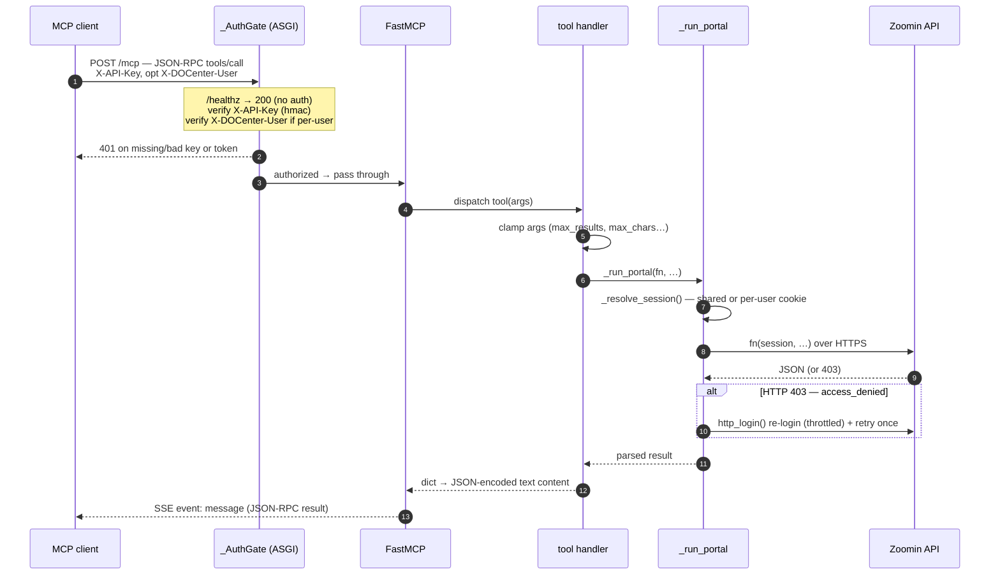
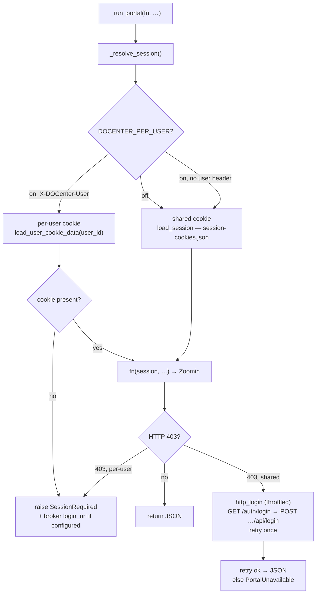
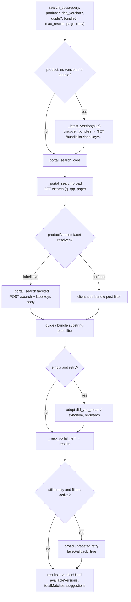
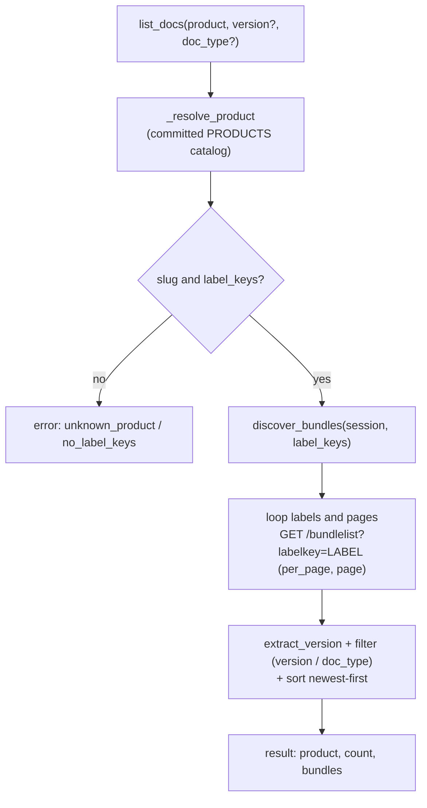
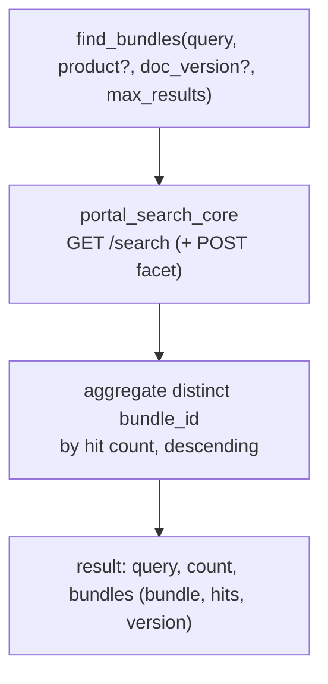
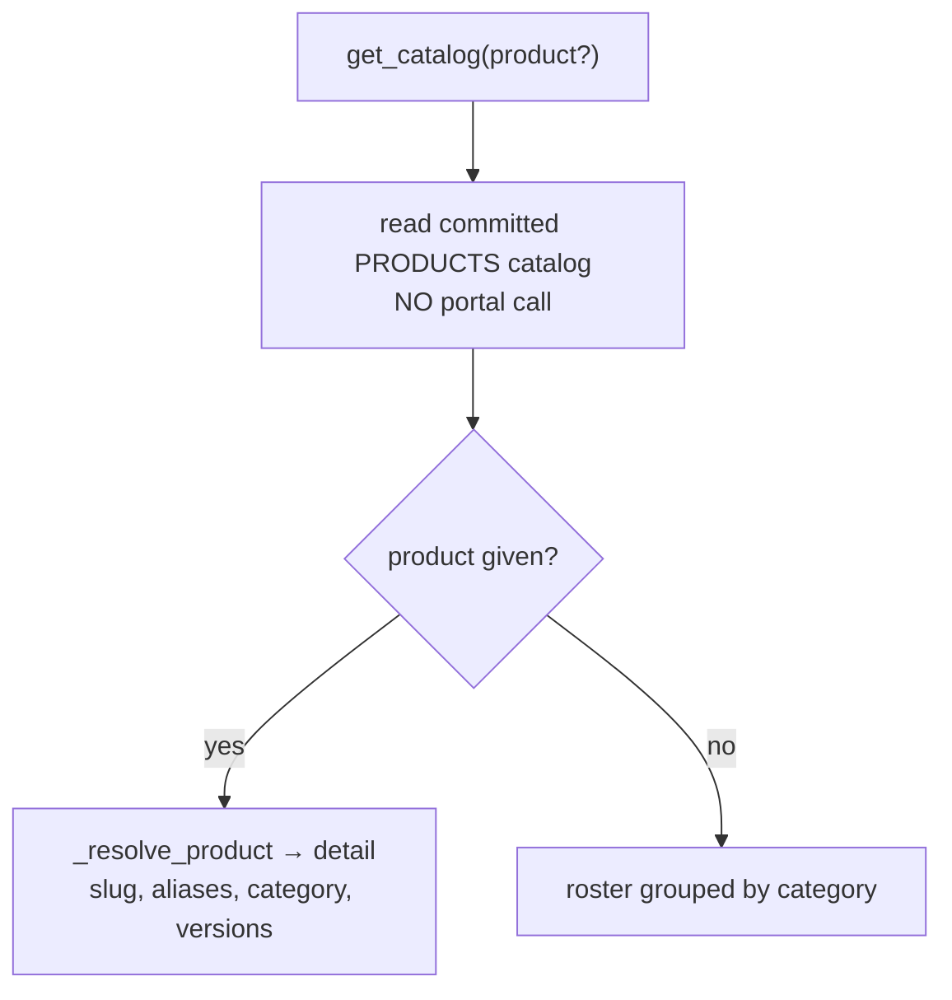
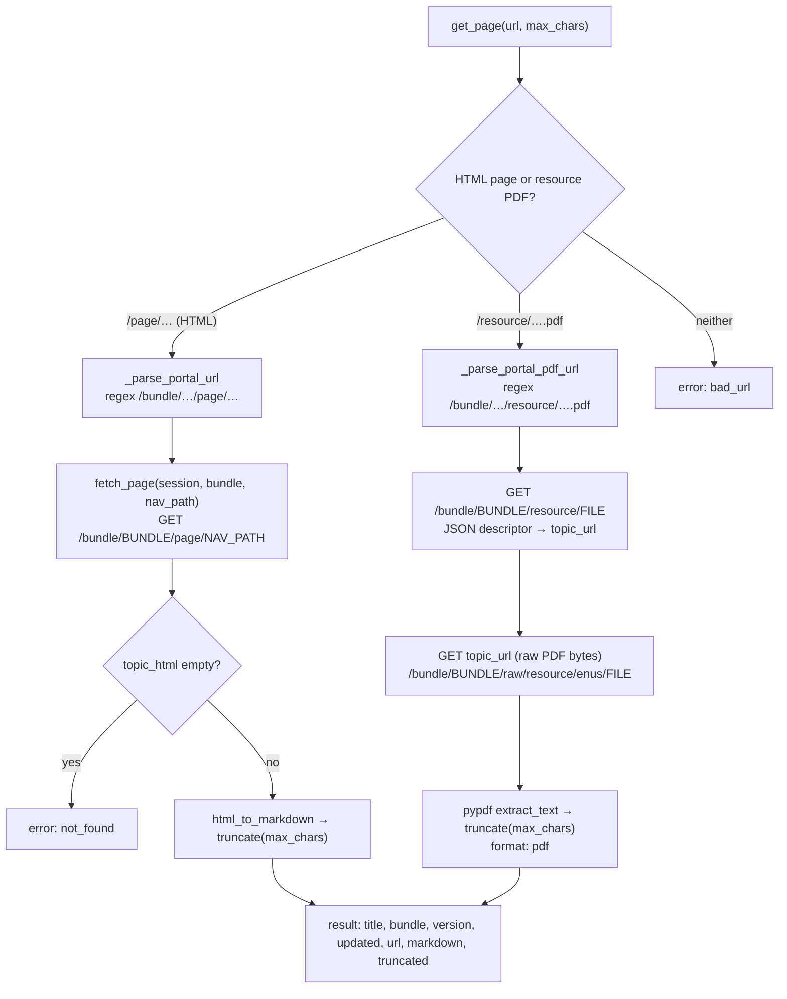
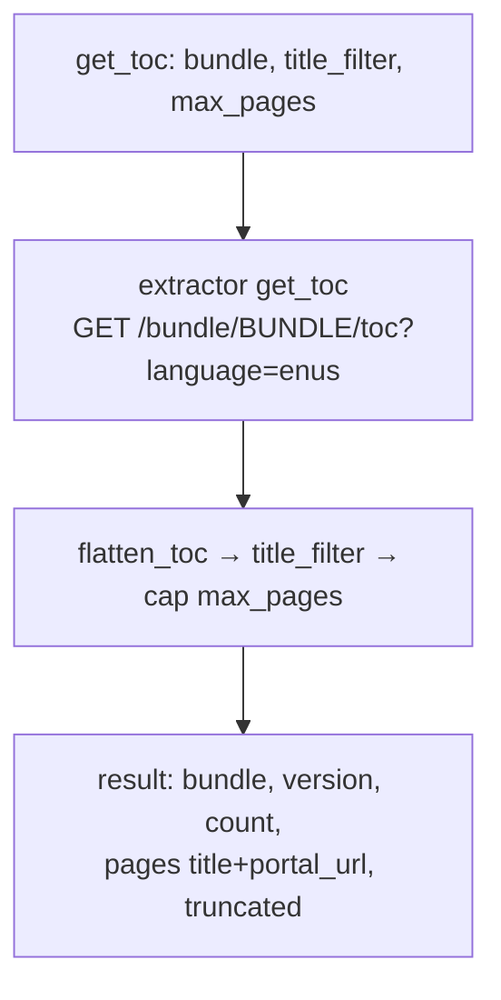

# docenter-mcp — request flows

Full request flow for every `docenter-mcp` tool: from the MCP `tools/call` all the
way to the **Zoomin/DOCenter backend** endpoint and back.

- Server + transport: [`server.py`](./server.py) — FastMCP over Streamable HTTP.
- Tool contracts (params + returns): [`TOOLS.md`](./TOOLS.md).
- Endpoint implementations: `docenter.cli` (`portal_search_core`, `discover_bundles`,
  `load_session`, `http_login`) and `extractor.extractor` (`fetch_page`, `get_toc`,
  `html_to_markdown`).

Every tool call travels the **same lifecycle**: an MCP client `POST`s JSON-RPC to
`/mcp`, the `_AuthGate` ASGI middleware authenticates it, FastMCP dispatches the
`@mcp.tool` handler, and the handler runs a portal call through `_run_portal` against
the Zoomin backend `https://docs-be.niceactimize.com/api` (`BASE_API`). Result URLs are
rewritten from the backend host `docs-be.niceactimize.com` to the user-facing
`docs.niceactimize.com` for citations. Only `get_catalog` never hits the portal — it
answers from the committed product catalog.

## Backend endpoints

Base URL `https://docs-be.niceactimize.com/api` (override via `DOCENTER_API_URL`).

| Backend call | Purpose | Used by |
|--------------|---------|---------|
| `GET /search?q=&rpp=&page=` | Broad keyword search | `search_docs`, `find_bundles` |
| `POST /search` (+ `labelkeys` body) | Server-side facet narrowing (product/version) | `search_docs`, `find_bundles` |
| `GET /bundlelist?labelkey=&per_page=50&page=` | Bundle discovery by label key | `list_docs`, `search_docs` (version default) |
| `GET /bundle/{name}` | A bundle's doc-type labels | `list_docs` (config bundles) |
| `GET /bundle/{bundle}/page/{nav_path}` | Full page (`topic_html`) | `get_page` (HTML) |
| `GET /bundle/{bundle}/resource/{file}` | Resource descriptor → `topic_url` (archived/PDF bundles) | `get_page` (PDF) |
| `GET /bundle/{bundle}/raw/resource/enus/{file}` | Raw PDF bytes (from `topic_url`) → pypdf text | `get_page` (PDF) |
| `GET /bundle/{bundle}/toc?language=enus` | Table of contents tree | `get_toc` |
| `GET /auth/login` → `POST /auth/page/localStorage/api/login` | Browser-free re-login (403 self-heal) | `_run_portal` |
| *(none — committed `PRODUCTS` catalog)* | Product↔slug↔version map | `get_catalog` |

## Shared request lifecycle

## Session resolution & 403 self-heal

Shared by every portal-backed tool (`_run_portal` in `server.py`). The per-user path
never touches the shared cookie, and a shared 403 triggers at most one throttled
re-login per cooldown window.

## `search_docs`

`portal_search_core` runs a broad `GET /search`, resolves product/version to portal
**label keys** and re-runs a faceted `POST /search`, then applies client-side
guide/bundle post-filters, a spelling/synonym retry, a broad **facet fallback**, and
**weak-result broadening**. Version defaulting first calls `discover_bundles` to find
the product's newest version.

## `list_docs`

Resolves the product slug from the committed catalog, then discovers every bundle by
paging `GET /bundlelist` over the product's label keys.

## `find_bundles`

Same live search as `search_docs`, but aggregates the **distinct bundles** among the
hits by frequency instead of returning pages.

## `get_catalog`

The only tool with **no portal round-trip** — it reads the committed `PRODUCTS` catalog
(shipped under `docenter/data`) and resolves names/aliases/versions offline.

## `get_page`

Parses the citation URL and reads the source in full. HTML topics (`/page/…`)
are fetched and converted from `topic_html` to Markdown; resource PDFs
(`/resource/….pdf`, common on older/archived bundles) are resolved to their raw
download via the resource descriptor's `topic_url`, then text-extracted with
pypdf (`format: "pdf"`). Shared logic lives in `extractor.fetch_pdf_text`.

## `get_toc`

Fetches the bundle's TOC tree, flattens it, and builds a page-title + `portal_url` list.

