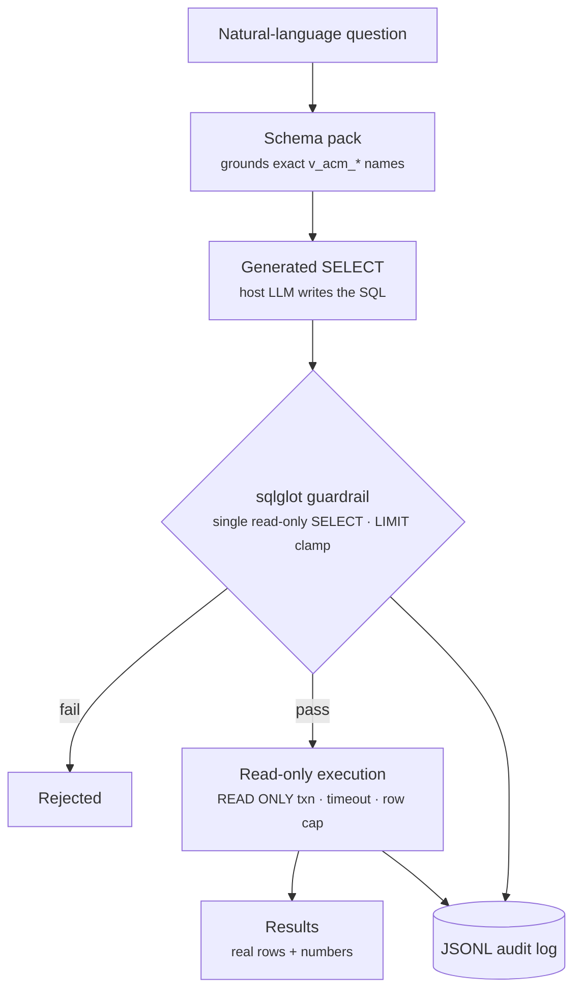

# data bucket

> Read-only natural-language-to-SQL over the ActOne `v_acm_*` PostgreSQL
> reporting views — the host LLM writes the SQL; this engine only grounds,
> validates, and executes it.

## Goal

data answers questions about ActOne with **real numbers and rows**. The engine
holds **no LLM key** and has **no write path**: a bundled schema pack grounds the
model on exact view/column names, a `sqlglot` guardrail proves a candidate query
is a single read-only `SELECT` over `v_acm_*` views, and execution runs in a
`READ ONLY` transaction with a statement timeout and row cap. Every attempt is
appended to a JSONL audit log with the originating question. It prefers permission-aware
`v_acm_item*` views over legacy `v_acm_alert*`.

## Packages

| Package | Role |
|---------|------|
| `actone_data` | The `actone-data` CLI plus the core engine: schema pack, `sqlglot` guardrail, DB layer, config/profiles, and audit log. |
| `actone_data_mcp` | The `actone-data-mcp` MCP server — exposes the schema/validate/run tools to agents. |

## CLI / MCP / Skills / Agent

- **CLI:** [`actone-data`](../cli/actone-data.md) — `ping`, `version`, `schema`,
  `query validate` / `query run`, `perf`, `audit`, `env`, `docs`, `eval`.
- **MCP:** [`actone-data-mcp`](../mcp/actone-data-mcp.md) — **17 read-only tools**
  across two surfaces: NL-to-SQL grounding + execution (schema summary, rules,
  list/describe, validate, run — all solution-aware) and performance diagnostics
  (health, indexes, vacuum, config, scored report, explain).
- **Skill:** [`actone-data`](../skills/actone-data.md) — the behavior spec for the
  `get_schema_summary → get_rules → list/describe → validate → run` loop.
- **Agent:** [ActWise Data](../agents/data.md) — grounded on
  `actone-data-mcp` via a self-hosted, API-key-gated MCP endpoint.

## Key concepts

- **Grounding, not guessing.** A bundled schema pack provides exact view and
  column names; the model must call `get_schema_summary` / `describe_view` before
  naming a view, so it never invents identifiers.
- **Multi-solution stack.** ActOne is a platform with **solutions** layered on
  top — some enhance the base schema (QAS), others add their own (SAM, CDD, CDD
  Profiles, STAR). Each is modeled as a `solution` schema pack + rule pack; the
  deployed schema name (e.g. `bppr_cdd_prf`) is resolved from the environment
  prefix.
- **Rule packs + PII masking.** Per-solution rule packs carry query conventions
  and a `masked_columns` list; direct-identifier (PII) columns are redacted to
  `***REDACTED***` at result time and reported in `run_query`.
- **7-step guardrail.** `sqlglot` enforces a single read-only `SELECT`/`UNION`
  over the allowlist and injects/clamps a LIMIT; the guardrail always
  re-runs inside `run_query`, so it can't be bypassed.
- **Read-only execution.** Queries run in a `READ ONLY` transaction with a
  statement timeout and row cap — no DML/DDL, no multi-statement.
- **Performance diagnostics (Surface B).** A parallel set of `perf_*` tools runs
  fixed, server-authored `pg_catalog` / `pg_stat_*` checks and a scored,
  doc-cited `perf_report` — issue detection with the same read-only guarantees.
- **Item views preferred.** Legacy `v_acm_alert*` views are not permission-aware;
  the engine steers to the unified, permission-aware `v_acm_item*` equivalents.
- **Audited.** Every attempt (accepted or rejected) is appended to a JSONL audit
  log with the originating question.

## See also

- [Buckets hub](index.md)
- MCP: [`actone-data-mcp`](../mcp/actone-data-mcp.md)
- Related buckets: [ops](ops.md) (live REST operations) · [docenter](docenter.md) (documentation)
