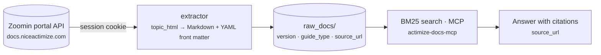

# docenter bucket

> Search, extract, and publish the live NICE Actimize documentation portal.

## Goal

docenter is the **documentation** pillar of ActWise. It wraps the Zoomin portal
(`docs.niceactimize.com`): the `docenter` CLI searches, downloads, and syncs
bundles; the `extractor` converts portal `topic_html` into Markdown under
`raw_docs/`; a local BM25 index and a live-portal MCP server both make that
knowledge queryable by agents; and a Copilot proxy grounds a Copilot Studio agent
on the portal without ingesting the corpus.

## Packages

| Package | Role |
|---------|------|
| `docenter` | The `docenter` CLI: search / list-docs / download / sync / auth / catalog / wiki / index / sharepoint / skill. |
| `extractor` | Converts portal `topic_html` → Markdown under `raw_docs/`, writing the YAML front matter (`version`, `guide_type`, `page_title`, `source_url`). |
| `mcp_server` | The local BM25 search index — served both as the `actimize-docs-mcp` stdio MCP server and a CLI search. |
| `docenter_mcp` | Re-exposes the **live** portal as the `docenter-mcp` HTTP MCP server (search + page fetch with citations). |
| `copilot_proxy` | Grounds a Copilot Studio agent on the portal without ingesting the corpus. |
| `sharepoint` | Uploads the extracted `raw_docs/` Markdown corpus to SharePoint / OneDrive via Microsoft Graph. |

## CLI / MCP / Skills / Agent

- **CLI:** [`docenter`](../cli/docenter.md) (alias `doccenter`) — search the live
  portal or the `--local` BM25 corpus, list/download/sync bundles, manage auth
  and the catalog.
- **MCP:** [`docenter-mcp`](../mcp/docenter-mcp.md) (live portal, HTTP, with
  citations) and [`actimize-docs-mcp`](../mcp/actimize-docs-mcp.md) (offline
  BM25, stdio).
- **Skill:** [`actimize-docenter`](../skills/actimize-docenter.md) — drives the
  `docenter` CLI for product-documentation Q&A.
- **Agent:** [ActWise Docs](../agents/docs.md) — grounded on the live
  `docenter-mcp` server via a self-hosted MCP endpoint.

## Key concepts

- **Live vs local.** Two grounding paths: the live portal (fresh, version-precise,
  cited) and an offline BM25 index over `raw_docs/` (network-free). Same corpus
  shape, different freshness/latency trade-offs.
- **Front matter is the data contract.** The extractor writes YAML front matter
  (`version`, `guide_type`, `page_title`, `source_url`) into every page; the
  local search MCP parses these directly, and answers must cite `source_url`.
- **Corpus layout.** Extracted docs live under
  `raw_docs/actone/v{version}/{bundle}/{slug}.md`; search and SharePoint upload
  both depend on this structure.
- **Version-segmented facets.** ActOne's portal taxonomy is version-segmented, so
  a product filter without a version can return zero upstream; `docenter-mcp`
  auto-defaults to the newest version and falls back/broadens as needed.
- **Auth.** Portal access uses a Zoomin `_SESSION` cookie in
  `browser-profile/session-cookies.json`, minted by `docenter auth login`.
- **Shared vs per-user.** The Copilot path uses one shared cookie for everyone.
  The [ActWise portal](../portal.md) adds a **per-user** path (`DOCENTER_PER_USER`)
  where each end user is served from their own captured cookie — an additive,
  flag-gated layer that a **login broker** (two-door SSO / password) feeds by
  capturing each user's `_SESSION`.

## See also

- [Buckets hub](index.md)
- Portal: [ActWise portal](../portal.md) (per-user DOCenter front end + broker)
- MCP: [`docenter-mcp`](../mcp/docenter-mcp.md) · [`actimize-docs-mcp`](../mcp/actimize-docs-mcp.md)
- Sibling buckets: [nicedl](nicedl.md) (install media) · [installer](installer.md)
