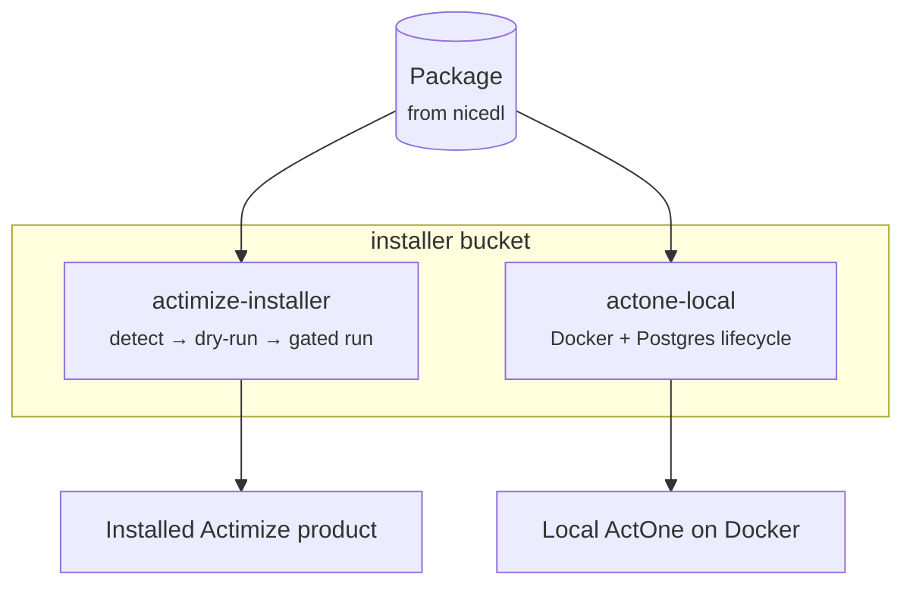

# installer bucket

> Install/upgrade Actimize packages behind a confirmation gate, and stand up
> ActOne core locally on Docker + PostgreSQL.

## Goal

installer is the **install-execution** end of the ActWise chain, complementing
[nicedl](nicedl.md) (which downloads the package) and [docenter](docenter.md)
(which supplies the guides). `actimize-installer` detects which Actimize installer
a downloaded package carries (`rcm-installer`, `Actimize-installer`, AIS
`setup.exe`), builds the exact command, and runs it **only behind a confirmation
gate** with captured logs — dry-run by default. `actone-local` automates an
idempotent, disk-aware ActOne 10.2 local Docker install: build the image and
stand up a lightweight Postgres in laptop-friendly phases.

## Packages

| Package | Role |
|---------|------|
| `actinstaller` | The `actimize-installer` CLI: detect an installer flavor, build the command, and run it behind a gate with captured logs. |
| `actone_local` | The `actone-local` CLI: idempotent, disk-aware phases to stand up ActOne 10.2 on Docker + PostgreSQL. |

## CLI / MCP / Skills / Agent

- **CLIs:** [`actimize-installer`](../cli/actimize-installer.md)
  (`detect` / `show` / `run`) and [`actone-local`](../cli/actone-local.md)
  (`doctor` / `config` / `extract` / `db-*` / `render-config` / `encrypt-config`
  / `build` / `run` / `up` / `status` / `verify` / `down`).
- **MCP:** none in this bucket.
- **Skills:** [`actimize-installer`](../skills/actimize-installer.md) drives the
  gated installer runner (`detect → run --dry-run → run --execute`);
  [`actone-local`](../skills/actone-local.md) drives the local Docker stand-up
  (`doctor → extract/db-*/render/encrypt → build → run`).
- **Agent:** none.

## Key concepts

- **End of the chain.** [nicedl](nicedl.md) downloads a package →
  `actimize-installer` installs it → [docenter](docenter.md) supplies the guide.
- **Dry-run by default, gated execution.** The installer runner builds the exact
  command and only runs it with `--execute` behind a confirmation gate; logs land
  in a timestamped `installer-runs/` directory.
- **Production guardrails.** Installs are blocked when a CONF references a
  production environment unless you pass `--allow-prod`, and unsupported upgrades
  are blocked with a clear message.
- **Idempotent, disk-aware local stand-up.** `actone-local` runs in phases with
  disk guards (build needs headroom), so light DB phases work on a laptop even
  when a full image build won't fit.
- **License + encryption.** The `run` phase needs a valid NICE `license.lic`, and
  the DB password is AES-encrypted into `acm.ini` via the bundled RCM Encryption
  Tool.

## See also

- [Buckets hub](index.md)
- Upstream bucket: [nicedl](nicedl.md) (obtains the package to install)
- Sibling bucket: [docenter](docenter.md) (install/upgrade guides)
