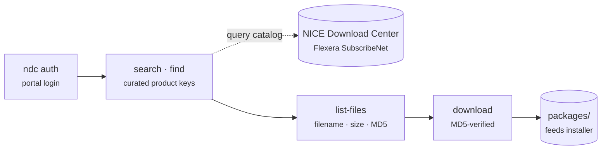

# nicedl bucket

> Search and download official NICE Actimize install media from the NICE
> Download Center.

## Goal

nicedl is the **install-package** counterpart to [docenter](docenter.md)
(documentation). The `ndc` CLI wraps the NICE Software Download Center (a Flexera
SubscribeNet portal): it lists product lines, searches releases, drills into a
release's files, and downloads them with **MD5 verification**, using the OS trust
store (via `truststore`) for corporate TLS interception. Friendly product keys
resolve the portal's opaque `plne` ids. Its artifacts feed the
[installer](installer.md) bucket and `actone-local`.

## Packages

| Package | Role |
|---------|------|
| `nicedl` | The `ndc` CLI: portal auth, product/release search, file listing, MD5-verified download, and the offline package-catalog cache. |

## CLI / MCP / Skills / Agent

- **CLI:** [`ndc`](../cli/ndc.md) — `products`, `find`, `product-lines`,
  `search`, `recent`, `list-files`, `download`, `auth`, `catalog`.
- **MCP:** none in this bucket. (A `nicedl_mcp` layer —
  `search_packages` / `list_package_files` / `recent_releases` + a gated
  `download_package` — is only *proposed* in the ecosystem blueprint, not shipped.)
- **Skill:** [`actimize-nicedl`](../skills/actimize-nicedl.md) — drives the
  `auth → find/search → list-files → download` flow with curated product keys.
- **Agent:** none.

## Key concepts

- **Install-media counterpart to docs.** nicedl fetches the installers, service
  packs, and patches; [docenter](docenter.md) fetches the matching guides.
- **Curated product keys.** Friendly aliases resolve the portal's opaque `plne`
  ids, so users search by `actone 10.2` instead of raw ids.
- **MD5-verified downloads.** Every file is verified against its published MD5.
- **Corporate TLS.** `truststore` uses the OS trust store so downloads work
  behind TLS-intercepting proxies.
- **Offline catalog cache.** `ndc catalog refresh` builds a product→releases
  cache (no signed URLs) so `find` works offline; `--online` hits the live portal.
- **Feeds the installer.** Downloaded packages land in `packages/` and are
  consumed by [installer](installer.md) / `actone-local`.

## See also

- [Buckets hub](index.md)
- Downstream bucket: [installer](installer.md) (installs the packages `ndc` fetches)
- Sibling bucket: [docenter](docenter.md) (the matching documentation)
