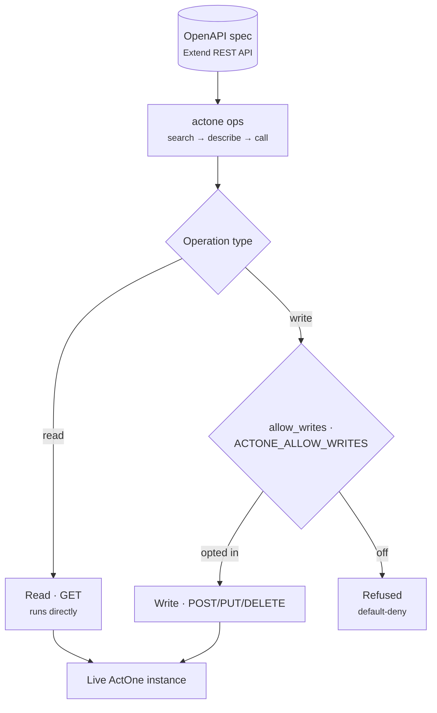

# ops bucket

> Turn a live ActOne instance into a discoverable, quirk-aware REST surface —
> Postman collections plus spec-driven runtime ops.

## Goal

ops is built the "generate-don't-hand-write" way from the ActOne **Extend REST
API** OpenAPI spec. The `actone` CLI has two halves: **build-time**
(fetch-spec / generate / provision / sanitize / review → Postman collections,
contract tests, config-review reports) and **run-time** (`actone ops` — a
`search → describe → call` discovery loop over the live API, read-only in P1).
`actone_mcp` exposes the runtime loop to agents; `postman/` holds the JS contract
tooling and the hard-won ActOne quirks catalog.

## Packages

| Package | Role |
|---------|------|
| `actone` | The `actone` CLI: build-time spec→Postman tooling plus the `actone ops` runtime discovery loop and the curated SOAP admin operations. |
| `actone_mcp` | The `actone-mcp` MCP server (FastMCP) — surfaces the runtime discovery loop and SOAP ops as tools. |
| `postman` | Node/JS contract tooling (portman) and the ActOne quirks catalog. |

## CLI / MCP / Skills / Agent

- **CLI:** [`actone`](../cli/actone.md) — `fetch-spec`, `generate`, `provision`,
  `sanitize`, `review`, and the `actone ops` runtime loop.
- **MCP:** [`actone-mcp`](../mcp/actone-mcp.md) — discover / describe / invoke
  live REST and curated SOAP operations, with writes gated.
- **Skills:** [`actone-ops`](../skills/actone-ops.md) drives the `actone ops`
  loop against a live ActOne; the separate `actone-api-suite` skill covers
  building/pushing Postman collections.
- **Agent:** [ActWise Ops](../agents/ops.md) — grounded on `actone-mcp`
  via a self-hosted, API-key-gated MCP endpoint, with confirm-before-write.

## Key concepts

- **Spec-driven, generate-don't-hand-write.** Everything derives from the live
  Extend REST API OpenAPI spec (Swagger 2.0 auto-converted to OAS3), so the
  operation surface stays in sync with the instance.
- **`search → describe → call`.** Never guess an operationId — discover it, read
  its params/request-body example and access, then invoke.
- **Default-deny writes.** Read (GET) operations run; writes are refused unless
  the operator opts in (`ACTONE_ALLOW_WRITES`, or per-environment `allow_writes`
  in `actone-ops.yaml`). Read-only in P1.
- **Curated SOAP where REST can't.** A curated SOAP layer covers the legacy Axis
  admin surface the REST API lacks — most importantly creating a Business Unit,
  the prerequisite for seeding work items on a fresh instance.
- **Quirks catalog.** `postman/` records hard-won ActOne quirks (multipart
  save-step, Tomcat rejecting raw JSON query chars, etc.).

## See also

- [Buckets hub](index.md)
- MCP: [`actone-mcp`](../mcp/actone-mcp.md)
- Related buckets: [data](data.md) (read-only SQL) · [utils](utils.md) (server-side utilities)
