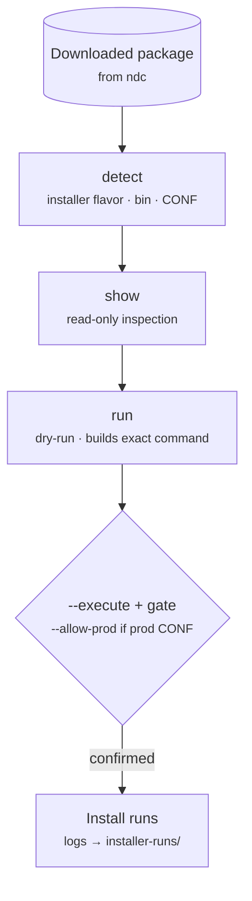

# `actimize-installer`

> Install an Actimize package fetched by [`ndc`](ndc.md) — dry-run by default,
> execution behind a gate.

## Goal

Drive the Actimize product installer safely: inspect a downloaded package to detect
its installer flavor, run the installer's own read-only `show`, and build the install
command as a **dry-run** — only executing behind an explicit gate.



## How it fits

`actimize-installer` is one of the two CLIs in the [installer bucket](../buckets/installer.md)
and is driven by the [actimize-installer](../skills/actimize-installer.md) skill. It
completes the chain **docs → packages ([`ndc`](ndc.md)) → install**. Its sibling
[`actone-local`](actone-local.md) stands ActOne up locally on Docker.

## Install / enable

Installed with the `actwise` distribution. Point it at a package directory produced by
`ndc download`.

## Command reference

| Command | Description |
| --- | --- |
| `detect` | Inspect a package and report its installer flavor, bin, and CONF files. |
| `show` | Run the installer's own read-only `show` command (safe to execute). |
| `run` | Build the install command (dry-run) and, with `--execute`, run it behind a gate. |

> For every argument and option of every sub-command, see the [full CLI reference](full-reference.md#actimize-installer).

### Key options

**`run`** — [`actimize-installer run`](full-reference.md#actimize-installer-run)

| Option | Meaning |
| --- | --- |
| `--package`, `-P` | Extracted package dir (or `.zip`) (required). |
| `--command` | `install` \| `upgrade` \| `show` (default: `install`). |
| `--mode` | `full` \| `sp` \| `patch` (alias for `--command`). |
| `--include`, `-i` | Only this task/step (repeatable). |
| `--exclude`, `-x` | Exclude this task/step (repeatable). |
| `--execute` | Actually run (default: dry-run). |
| `--yes` | Skip the confirmation prompt (with `--execute`). |
| `--allow-prod` | Permit a prod-looking CONF. |
| `--json` | Machine-readable plan output. |

**`detect`** — [`actimize-installer detect`](full-reference.md#actimize-installer-detect)

| Option | Meaning |
| --- | --- |
| `--package`, `-P` | Extracted package dir (or `.zip`) (required). |
| `--extract` | Extract if a `.zip` is given. |
| `--json` | Machine-readable output. |

**`show`** — [`actimize-installer show`](full-reference.md#actimize-installer-show)

| Option | Meaning |
| --- | --- |
| `--package`, `-P` | Extracted package dir (or `.zip`) (required). |
| `--verbose`, `-V` | Show step detail. |
| `--extract` | Extract if a `.zip` is given. |

Run `actimize-installer <command> --help` for flags.

## Walkthrough

```powershell
# 1. Detect the installer flavor of a downloaded package
actimize-installer detect --package C:\packages\actone-10.2

# 2. Safe read-only inspection via the installer's own show
actimize-installer show --package C:\packages\actone-10.2

# 3. Preview the install command (dry-run) …
actimize-installer run --package C:\packages\actone-10.2

# 4. … then execute behind the gate
actimize-installer run --package C:\packages\actone-10.2 --execute
```

## Under the hood

- **`detect`** figures out which installer flavor a package uses (e.g.
  `rcm-installer` / `Actimize-installer` / AIS `setup.exe`) and locates its bin and
  CONF files.
- **`run` is dry-run by default**, printing the exact command it would execute;
  `--execute` runs it behind a gate.

## See also

- Bucket: [installer](../buckets/installer.md)
- Skill: [actimize-installer](../skills/actimize-installer.md)
- Upstream: [`ndc`](ndc.md) · Local dev: [`actone-local`](actone-local.md)
