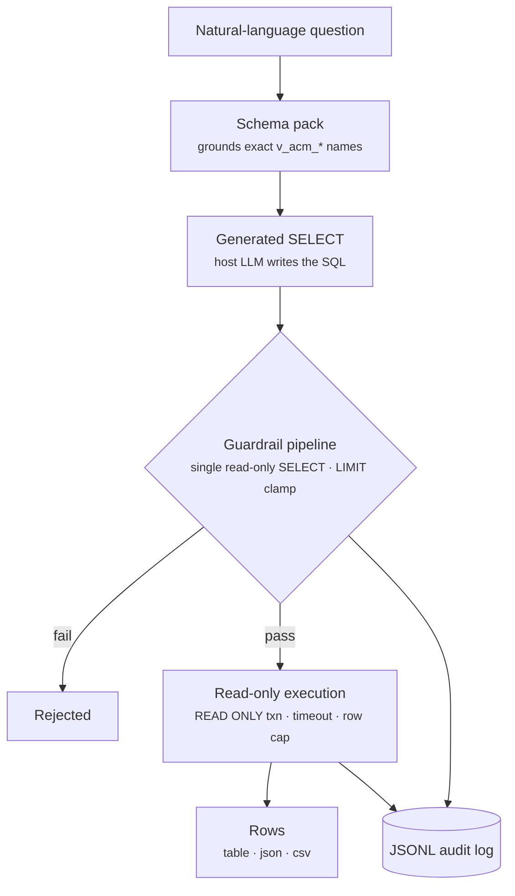

# `actone-data`

> Ask questions in plain English and get **real numbers** — a read-only query engine
> over the ActOne `v_acm_*` PostgreSQL reporting views.

## Goal

Answer analytics questions about a live ActOne system (counts, lists, aggregates over
work items, alerts, cases, blotters, queues, users, item types, policies) by turning a
natural-language question into **one safe `SELECT`**, validating it, and running it on
a read-only, row-capped, audited session.



## How it fits

`actone-data` is the CLI core of the [data bucket](../buckets/data.md). The same engine
is exposed as the [`actone-data-mcp`](../mcp/actone-data-mcp.md) MCP server and driven
by the [actone-data](../skills/actone-data.md) skill; it grounds the
[ActWise Data](../agents/data.md) Copilot Studio agent.

## Install / enable

Installed with the `actwise` distribution. Configure a DB profile in `actone-data.yaml`
(host, port, name, **read-only** user, schema) with the password in
`actone-data.secrets.yaml` — see [Install](../install.md).

```powershell
actone-data ping     # verify the connection + ActOne sentinel check
```

## Command reference

| Command | Description |
| --- | --- |
| `ping` | Test the DB connection: prints server version, schema, and the ActOne sentinel check. |
| `version` | Detect the ActOne product version from the DB (falls back to the bundled doc version). |
| `eval` | Run the NL→SQL eval set through the guardrail + execute path and print a scoreboard. |
| `schema` | Introspect the live ActOne schema (`v_acm_*` views) or a solution's schema pack (`--solution`). |
| `solutions` | Business solutions — a product's licensed fraud lines (e.g. IFM Retail/Card/NAF) + client detection. |
| `query` | Validate or run a read-only `SELECT` over the `v_acm_*` views (or a solution's tables). |
| `rules` | Show a solution's rule pack — advisory guidance, enforced constraints, and masked (PII) columns. |
| `audit` | Inspect the query audit log. |
| `perf` | Read-only performance diagnostics — fixed server-authored catalog queries + a scored report. |
| `env` | List the configured ActOne environments (DB profiles). |
| `docs` | Parse the `v_acm_*` doc pages (descriptions + FK graph). |

> For every argument and option of every sub-command, see the [full CLI reference](full-reference.md#actone-data).

Several commands are **groups** with their own sub-commands:

**`schema`** — Introspect the live ActOne schema (`v_acm_*` views).

| Sub-command | Description |
| --- | --- |
| `schema list` | List the live `v_acm_*` views and their column counts. |
| `schema solutions` | List every grounded surface — the ActOne platform plus each solution pack — with schema, version, object counts, description coverage, and draft/ready status (`--format table\|json`). |
| `schema build` | Build the schema pack (introspection + doc enrichment) and write JSON. |
| `schema show` | Show a view's family/preference/FKs and columns from the schema pack. |
| `schema summary` | Summarize the schema pack (view/column/coverage/preference counts). |

**`query`** — Validate or run a read-only `SELECT` over the `v_acm_*` views.

| Sub-command | Description |
| --- | --- |
| `query validate` | Dry-run the guardrail pipeline on a SQL string (no execution). |
| `query run` | Validate and execute a read-only `SELECT`; prints results. |

**`solutions`** — Business solutions: a product's licensed fraud lines + client detection.

| Sub-command | Description |
| --- | --- |
| `solutions list` | List a product's business solutions + add-ons and their DB markers (offline, from the business-solution catalog). Accepts `--product`/`-P` and `--format table\|json`. |
| `solutions detect` | Detect which business solutions a live deployment actually runs — introspects the resolved schemas and matches catalog markers (`present`/`absent`/`config-only`). Scoped by `--profile`/`-p` + `--product`/`-P`. |

**`rules`** — Inspect a solution's rule pack (advisory guidance + enforced constraints).

| Sub-command | Description |
| --- | --- |
| `rules show` | Show a solution's active rule pack: advisory guidance, enforced constraints (allowlist prefixes, deny objects, row caps), and masked (PII) columns — the CLI twin of the MCP `get_rules` tool. Accepts `--solution`/`-s` and `--format table\|json`. |

**`perf`** — Read-only performance diagnostics (fixed server-authored queries; the
model/CLI *names a check*, it never writes catalog SQL).

| Sub-command | Description |
| --- | --- |
| `perf extensions` | Which perf extensions are installed (`pg_stat_statements`, `pgstattuple`, `hypopg`). |
| `perf health` | Cache hit ratio, rollbacks/deadlocks, connections, wraparound headroom. |
| `perf top-queries` | Worst queries from `pg_stat_statements` (`sort`: total\|mean\|io\|calls). |
| `perf indexes` | Unused and invalid indexes (drop / REINDEX candidates). |
| `perf missing-indexes` | Tables with heavy sequential scans (indexing hotspots). |
| `perf vacuum` | Dead-tuple accumulation + autovacuum recency/settings. |
| `perf bloat` | Table bloat via `pgstattuple` (notes if the extension is absent). |
| `perf config` | Key planner / memory / autovacuum settings (advisory). |
| `perf report` | Scored recommendation report rolling up all checks — including advisory `CREATE INDEX` candidates for unindexed foreign keys (findings carry a `source_url` doc citation). |
| `perf explain` | `EXPLAIN (FORMAT JSON)` a guardrail-validated SELECT (optional HypoPG hypothetical indexes). |

**`audit`** — Inspect the query audit log.

| Sub-command | Description |
| --- | --- |
| `audit tail` | Show the most recent audit records. |

**`env`** — List the configured ActOne environments (DB profiles).

| Sub-command | Description |
| --- | --- |
| `env list` | List configured environments (metadata only; never passwords). |

**`docs`** — Parse the `v_acm_*` doc pages (descriptions + FK graph).

| Sub-command | Description |
| --- | --- |
| `docs enrich` | Parse the `v_acm_*` doc pages and resolve the FK graph. |

### Key options

**`query run`** — [`actone-data query run`](full-reference.md#actone-data-query-run)

| Option | Meaning |
| --- | --- |
| `--profile`, `-p` | Named profile (default: built-in local). |
| `--dsn` | Full libpq DSN (wins over profile/env). |
| `--max-rows` | Max rows to return (cap 1000, default 100). |
| `--question`, `-q` | The user question, recorded for audit. |
| `--format`, `-f` | Output format: `table` \| `json` \| `csv`. |

**`query validate`** — [`actone-data query validate`](full-reference.md#actone-data-query-validate)

| Option | Meaning |
| --- | --- |
| `--profile`, `-p` | Profile used to fetch the live allowlist. |
| `--dsn` | Full libpq DSN (wins over profile/env). |
| `--max-rows` | Row limit to inject/clamp to (cap 1000, default 100). |

**`schema build`** — [`actone-data schema build`](full-reference.md#actone-data-schema-build)

| Option | Meaning |
| --- | --- |
| `--profile`, `-p` | Named profile (default: built-in local). |
| `--bundle` | Doc bundle dir (default: ActOne 10.2 Implementer Guide). |
| `--doc-version` | Override the doc/pack version when the DB carries no stamp. |
| `--out` | Output path (default: bundled `data/schema-pack-actone-<ver>.json`). |

Run `actone-data <command> --help` for flags.

## Walkthrough

```powershell
# 1. See which reporting views exist and their columns
actone-data schema --view v_acm_item

# 2. Validate a query without running it (guardrail check)
actone-data query --validate "SELECT count(*) FROM v_acm_item WHERE status='OPEN'"

# 3. Run it read-only and see the rows
actone-data query "SELECT count(*) FROM v_acm_item WHERE status='OPEN'"

# 4. Review what was run
actone-data audit
```

## Under the hood

- **Read-only by construction.** Every query passes a guardrail pipeline that rejects
  anything but a single `SELECT`; execution runs on a read-only, row-capped, audited
  session — no INSERT/UPDATE/DELETE/DDL.
- **Grounded on the reporting views.** It prefers the permission-aware `v_acm_item*`
  views and uses the parsed `docs` (descriptions + FK graph) as schema context.
- **Multi-solution aware.** `schema list/show` and `query` accept `--solution`
  (`-s`) to ground on an installed solution's pack (SAM, CDD, CDD Profiles, CDD
  DART, STAR, QAS, …); the deployed schema name (e.g. `bppr_cdd_prf`) is resolved
  from the environment prefix, and rule packs add per-solution conventions + PII
  masking.
- **Performance diagnostics.** `perf` runs fixed, server-authored catalog checks
  and a scored `perf report` (doc-cited findings) — a read-only tuning surface that
  never executes model-authored SQL.
- **`eval`** scores the NL→SQL pipeline against a bundled eval set for regression
  tracking.

## See also

- Bucket: [data](../buckets/data.md)
- MCP: [actone-data-mcp](../mcp/actone-data-mcp.md)
- Skill: [actone-data](../skills/actone-data.md)
- Agent: [ActWise Data](../agents/data.md)
