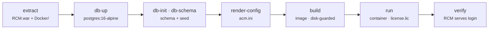

# `actone-local`

> Stand up ActOne core locally on Docker + PostgreSQL — idempotent, disk-aware, and
> laptop-friendly.

## Goal

Get a working ActOne on your own machine for dev or demo: build the image from a
downloaded package, start a lightweight Postgres, initialise the schema, render
`acm.ini`, and run the container — with **every phase safe to re-run** and the heavy
image build disk-guarded.



## How it fits

`actone-local` is the second CLI in the [installer bucket](../buckets/installer.md)
and is driven by the [actone-local](../skills/actone-local.md) skill. It's the
*run-it-locally* counterpart to [`ndc`](ndc.md) (which downloads the package) and
[`actimize-installer`](actimize-installer.md) (which drives the product installer).

## Install / enable

Installed with the `actwise` distribution. Requires Docker and a `license.lic`.
Start with a preflight:

```powershell
actone-local doctor      # docker, disk headroom, package, WAR, license, image
actone-local config --init
```

## Command reference

| Command | Description |
| --- | --- |
| `doctor` | Preflight: docker, disk headroom, package, WAR, license, image. |
| `config` | Show the effective config (or `--init` to scaffold one). |
| `extract` | Extract only the lean build inputs (`RCM.war` + `Docker/`) from the payload. |
| `db-up` | Start the lightweight PostgreSQL container (`postgres:16-alpine`). |
| `db-init` | Create the ActOne schema (lower-case) + `search_path`. |
| `db-schema` | Populate the ActOne DDL + seed data (`dbupgrade -exec -new`). Takes a few minutes. |
| `render-config` | Write `acm.ini` (PostgreSQL, plaintext password) into the work dir. |
| `encrypt-config` | Encrypt the DB password (bundled tool) and rewrite `acm.ini` with the IV. |
| `build` | Build the ActOne Docker image (disk-guarded). |
| `run` | Run the ActOne container (needs a `license.lic`). |
| `status` | Show ActOne + DB container status. |
| `verify` | Wait until the RCM webapp actually serves (login redirect) — not just "container started". |
| `down` | Stop & remove the containers (keep the DB volume unless `--purge`). |
| `up` | Orchestrate all phases end-to-end (each idempotent). |

> For every argument and option of every sub-command, see the [full CLI reference](full-reference.md#actone-local).

Every command accepts `--config`, `-c` (path to `actone-local.yaml`, else defaults). The commands with extra flags are:

### Key options

**`up`** — [`actone-local up`](full-reference.md#actone-local-up)

| Option | Meaning |
| --- | --- |
| `--force` | Override the build disk guard. |
| `--skip-build` | Stop before build/run (safe phases only). |

**`verify`** — [`actone-local verify`](full-reference.md#actone-local-verify)

| Option | Meaning |
| --- | --- |
| `--timeout` | Seconds to wait for RCM to serve (default 180). |

**`down`** — [`actone-local down`](full-reference.md#actone-local-down)

| Option | Meaning |
| --- | --- |
| `--purge` | Also delete the Postgres data volume. |

**`config`** — [`actone-local config`](full-reference.md#actone-local-config)

| Option | Meaning |
| --- | --- |
| `--init` | Write a default `actone-local.yaml`. |

**`build`** — [`actone-local build`](full-reference.md#actone-local-build)

| Option | Meaning |
| --- | --- |
| `--force` | Build even if disk is below the safety line. |

Run `actone-local <command> --help` for flags.

## Walkthrough

```powershell
# One-shot: run every phase end-to-end (each step is idempotent)
actone-local up

# …or step through manually
actone-local extract
actone-local db-up
actone-local db-init
actone-local db-schema
actone-local render-config
actone-local build
actone-local run
actone-local verify
```

## Under the hood

- **Idempotent phases.** Each command is safe to re-run; `up` orchestrates them all.
- **Disk-aware.** The heavy `build` is guarded against low disk headroom (`doctor`
  reports it up front).
- **Real readiness.** `verify` waits until the RCM webapp actually serves a login
  redirect, not just until the container reports "started".

## See also

- Bucket: [installer](../buckets/installer.md)
- Skill: [actone-local](../skills/actone-local.md)
- Upstream: [`ndc`](ndc.md) · [`actimize-installer`](actimize-installer.md)
