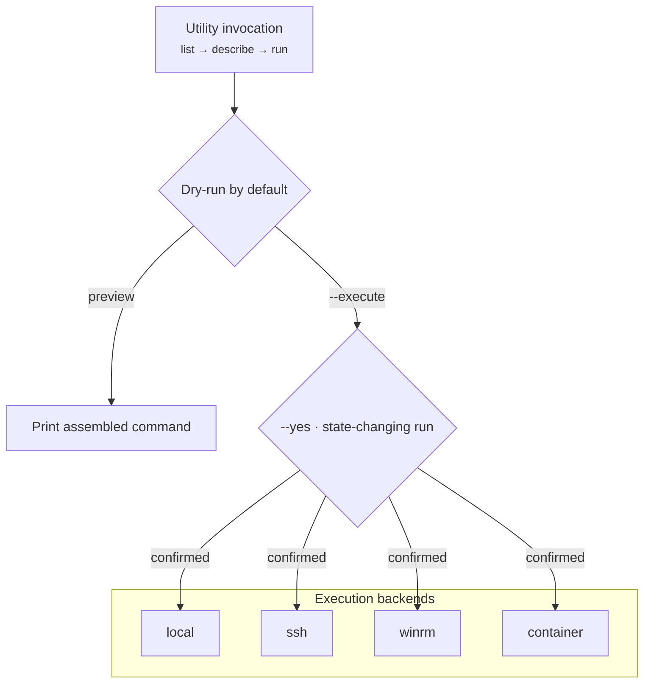

# `actone-utils`

> A typed runner for ActOne's server-side Java maintenance utilities (Blotter
> Maintenance, DART, and more) over local / ssh / winrm backends — dry-run by default.

## Goal

Make ActOne's server-side utility JARs safe and repeatable to run: discover what's
available, see a utility's exact parameters and access requirements, and assemble +
run it — with a **dry-run-first** posture and a gate on anything state-changing.



## How it fits

`actone-utils` is the CLI core of the [utils bucket](../buckets/utils.md). The same
runner is exposed as the [`actone-utils-mcp`](../mcp/actone-utils-mcp.md) MCP server
and driven by the [actone-utils](../skills/actone-utils.md) skill.

## Install / enable

Installed with the `actwise` distribution. Check the effective backend/paths/JDK:

```powershell
actone-utils doctor
actone-utils backends
```

## Command reference

| Command | Description |
| --- | --- |
| `list` | List all utilities in the catalog. |
| `search` | Search utilities by keyword (name/title/tool/tags/summary). |
| `describe` | Show a utility's parameters, access, and source doc. |
| `run` | Assemble and run a utility. Dry-run by default; `--yes` for a real state-changing run. |
| `backends` | Show the available execution backends. |
| `doctor` | Show the effective config: backend, paths, JDK, `utilities.env`. |

> For every argument and option of every sub-command, see the [full CLI reference](full-reference.md#actone-utils).

### Key options

**`run`** — [`actone-utils run`](full-reference.md#actone-utils-run)

| Option | Meaning |
| --- | --- |
| `--set`, `-s` | Parameter as `KEY=VALUE` (repeatable). |
| `--arg`, `-a` | Raw arg appended verbatim (repeatable; for options not in the catalog). |
| `--dry-run` / `--execute` | Assemble only (default), or actually run. |
| `--yes` | Confirm a state-changing real run. |
| `--backend` | Override backend: `local` \| `ssh` \| `winrm` \| `container`. |
| `--config` | Path to `actone-utils.yaml`. |
| `--json` | Emit JSON. |

**`search`** — [`actone-utils search`](full-reference.md#actone-utils-search)

| Option | Meaning |
| --- | --- |
| `--limit` | Max results (default 25). |
| `--json` | Emit JSON. |

**`describe`** — [`actone-utils describe`](full-reference.md#actone-utils-describe)

| Option | Meaning |
| --- | --- |
| `--json` | Emit JSON. |

Run `actone-utils <command> --help` for flags.

## Walkthrough

```powershell
# 1. Find the blotter utility and read its parameters
actone-utils search blotter
actone-utils describe blotter-maintenance

# 2. Preview the exact command (dry-run — nothing runs)
actone-utils run blotter-maintenance --param ...

# 3. Execute for real (state-changing → requires --yes)
actone-utils run blotter-maintenance --param ... --yes
```

## Under the hood

- **Discovery loop:** `list` → `search` → `describe` → `run`, so you always see a
  utility's parameters and access requirements before executing.
- **Backends:** the same invocation can target `local`, `ssh`, `winrm`, or a
  container backend; `doctor` shows which is effective and where the JDK/paths resolve.
- **Safety:** `run` is **dry-run by default** and prints the assembled command; a real
  state-changing run requires `--yes`.

## See also

- Bucket: [utils](../buckets/utils.md)
- MCP: [actone-utils-mcp](../mcp/actone-utils-mcp.md)
- Skill: [actone-utils](../skills/actone-utils.md)
