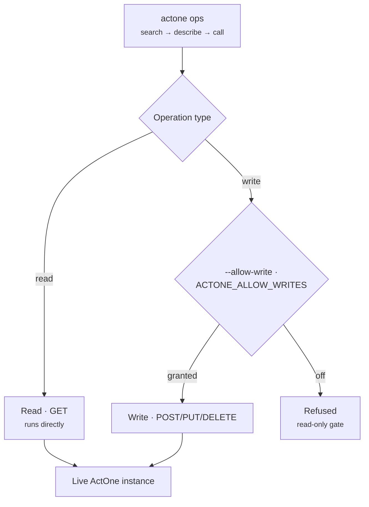

# `actone`

> Turn a live ActOne instance's REST surface into an automation suite — download the
> OpenAPI spec, generate Postman collections, and run spec-driven runtime operations.

## Goal

Give ActOne's **Extend REST API** a discoverable, quirk-aware tooling layer: fetch and
sanitize the live spec, generate a logically organized Postman collection from it, and
run read operations directly from the command line — with a **read-only-first** posture.



## How it fits

`actone` is the CLI core of the [ops bucket](../buckets/ops.md). Its `ops` runtime
surface is also exposed as the [`actone-mcp`](../mcp/actone-mcp.md) MCP server and
driven by the [actone-ops](../skills/actone-ops.md) skill; the Postman/collection
workflow is driven by the [actone-api-suite](../skills/actone-api-suite.md) skill. It
grounds the [ActWise Ops](../agents/ops.md) Copilot Studio agent.

## Install / enable

Installed with the `actwise` distribution. Configure an ActOne instance profile in
`actone-ops.yaml` (URL, `context_root`, user, `allow_writes`) with the password in
`actone-ops.secrets.yaml` — see [Install](../install.md) and [Configuration](../config.md).

## Command reference

| Command | Description |
| --- | --- |
| `fetch-spec` | Download the live OpenAPI spec from an ActOne URL (auto-converts Swagger 2.0 → OAS3). |
| `generate` | Generate a logically-organized Postman collection from an OpenAPI spec. |
| `provision` | One-shot: fetch spec → generate collection → optionally push to a Postman workspace. |
| `sanitize` | Flatten self-referential enums and break `$ref` cycles to produce a portman-safe spec. |
| `review` | Read-only review of key ActOne configuration via its REST API. |
| `ops` | Spec-driven runtime ops over the ActOne Extend REST API (discovery: `search`/`describe`/`call`). Read-only in P1. |

> For every argument and option of every sub-command, see the [full CLI reference](full-reference.md#actone).

**`ops`** is a command group — spec-driven runtime ops over the ActOne Extend REST API:

| Sub-command | Description |
| --- | --- |
| `ops search` | Find operations by keyword over operationId/summary/tags/path. |
| `ops describe` | Show full detail (params, body example, access) for one operationId. |
| `ops tags` | List operation tags (domains) and counts. |
| `ops list` | List ALL operations (no cap), optionally by tag or grouped. |
| `ops call` | Invoke an operation live. Reads always run; writes need `--allow-write`. |
| `ops env` | List configured ActOne environments (never shows passwords). |
| `ops version` | Login and report the detected ActOne version. |
| `ops sync-skill` | Regenerate the auto-generated domains table in `skills/actone-ops/SKILL.md` from the spec. |
| `ops soap` | Curated ActOne SOAP ops (admin surface the REST API lacks). |

`ops soap` is itself a sub-group:

| Sub-command | Description |
| --- | --- |
| `ops soap list` | List the curated SOAP operations (offline). |
| `ops soap describe` | Show one SOAP op's service/operation/access/params. |
| `ops soap call` | Invoke a curated SOAP op. Reads always run; writes need `--allow-write`. |

### Key options

**`ops call`** — [`actone ops call`](full-reference.md#actone-ops-call)

| Option | Meaning |
| --- | --- |
| `--p` | Param as `key=value` (repeatable). |
| `--params` | All params as one JSON object. |
| `--body` | Request body as JSON. |
| `--env` | Named ActOne environment (see `actone ops env`). |
| `--url` | ActOne base URL (else `.env`). |
| `--allow-write` | Permit write ops (POST/PUT/DELETE/PATCH). Also honored via `ACTONE_ALLOW_WRITES=true`. Off by default (read-only gate). |

**`ops search`** — [`actone ops search`](full-reference.md#actone-ops-search)

| Option | Meaning |
| --- | --- |
| `--limit`, `-n` | Max rows to show (default 25). |
| `--reads-only` | Only show read (GET) operations. |
| `--spec` | Spec path override (else cached/bundled). |

**`generate`** — [`actone generate`](full-reference.md#actone-generate)

| Option | Meaning |
| --- | --- |
| `--spec` | OpenAPI spec (yaml or json). |
| `--version` | ActOne version label, e.g. `10.0.0.69_SP15`. |
| `--name` | Collection name (overrides default). |
| `--out` | Output collection path. |

Run `actone <command> --help` for flags.

## Walkthrough

```powershell
# 1. Pull and sanitize the live spec
actone fetch-spec --url https://<your-actone-host>/<context_root>

# 2. Discover runtime operations, then describe and call a read op
actone ops search "work item type"
actone ops describe listWorkItemTypes
actone ops call listWorkItemTypes

# 3. One-shot Postman collection
actone provision --url https://<your-actone-host>/<context_root>
```

## Under the hood

- **`ops`** is *spec-driven*: it reads the OpenAPI operations to offer a
  discover → describe → invoke loop, so it adapts to whatever the target ActOne
  exposes. Writes are gated (read-only in the current phase).
- **`sanitize`** exists because ActOne's generated spec has self-referential enums and
  `$ref` cycles that break downstream tooling; it flattens them.
- **`review`** performs a purely read-only pass over key configuration.

## See also

- Bucket: [ops](../buckets/ops.md)
- MCP: [actone-mcp](../mcp/actone-mcp.md)
- Skills: [actone-ops](../skills/actone-ops.md) · [actone-api-suite](../skills/actone-api-suite.md)
- Agent: [ActWise Ops](../agents/ops.md)
