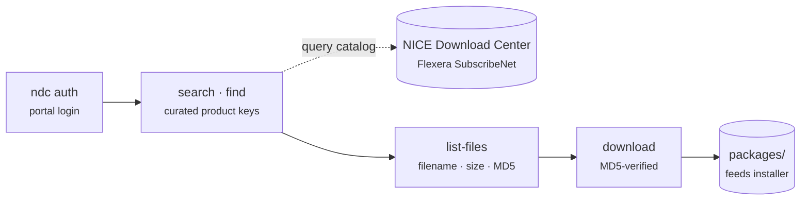

# `ndc`

> Search and download official Actimize **installation packages** from the NICE
> Download Center (Flexera SubscribeNet).

## Goal

Find and fetch the right install media — installers, service packs, patches — for an
Actimize product and version, with **MD5-verified** downloads. `ndc` is the
packages counterpart to [`docenter`](docenter.md) (documentation).



## How it fits

`ndc` is the CLI core of the [nicedl bucket](../buckets/nicedl.md) and is driven by
the [actimize-nicedl](../skills/actimize-nicedl.md) skill. It sits upstream of the
[installer](../buckets/installer.md) bucket: **docs → packages → install**.

## Install / enable

Installed with the `actwise` distribution. Authenticate to the Download Center first:

```powershell
ndc auth
```

## Command reference

| Command | Description |
| --- | --- |
| `products` | List curated product keys (friendly aliases for plne ids + components). |
| `find` | Locate a package by product + version — e.g. `ndc find actone 10.2`. |
| `product-lines` | List product lines (manufacturers) available on the portal. |
| `search` | Search product releases. Returns element/plne ids for `list-files` / `download`. |
| `recent` | List recent product releases posted to the portal. |
| `list-files` | List the downloadable files in a release (filename, size, MD5). |
| `download` | Download the installation package files for a release (with MD5 verification). |
| `auth` | Authenticate to the NICE Download Center. |
| `catalog` | Build/inspect the offline package catalog cache. |

> For every argument and option of every sub-command, see the [full CLI reference](full-reference.md#ndc).

Two commands are **groups** with their own sub-commands:

**`auth`** — Authenticate to the NICE Download Center.

| Sub-command | Description |
| --- | --- |
| `auth login` | Log in using credentials from `.env` (`NDC_EMAIL` / `NDC_PASSWORD`) or `--email`/`--password`. |
| `auth status` | Show whether the stored session is still valid. |
| `auth logout` | Clear the stored session. |

**`catalog`** — Build/inspect the offline package catalog cache.

| Sub-command | Description |
| --- | --- |
| `catalog refresh` | Sweep the portal and (re)build the offline catalog cache. |
| `catalog status` | Show catalog freshness and per-product release counts. |

### Key options

**`download`** — [`ndc download`](full-reference.md#ndc-download)

| Option | Meaning |
| --- | --- |
| `--plne` | Product-line id (from `search`). |
| `--cert-num` | Optional `cert_num` from `search`. |
| `--dest` | Destination directory (default: `packages`). |
| `--match` | Only files whose name contains this substring. |
| `--dry-run` | List what would be downloaded. |
| `--no-verify` | Skip MD5 verification. |

**`search`** — [`ndc search`](full-reference.md#ndc-search)

| Option | Meaning |
| --- | --- |
| `--product`, `-p` | Curated product key (see `ndc products`), e.g. `actone`. |
| `--variant` | Filter: `Full` \| `SP` \| `Patch`. |
| `--version` | Filter by version substring, e.g. `6.0`. |
| `--max` | Max rows (default 40). |

**`find`** — [`ndc find`](full-reference.md#ndc-find)

| Option | Meaning |
| --- | --- |
| `--variant` | `Full` \| `SP` \| `Patch`. |
| `--online` | Query the live portal instead of the cache. |
| `--json` | Output machine-readable JSON. |

Run `ndc <command> --help` for flags.

## Walkthrough

```powershell
# 1. Locate an ActOne 10.2 package
ndc find actone 10.2

# 2. See the files in the release (with sizes + MD5)
ndc list-files <element-id>

# 3. Download with MD5 verification
ndc download <element-id>
```

## Under the hood

- Talks to the **Flexera SubscribeNet** portal that backs the NICE Download Center.
- `products` provides friendly aliases so you don't need raw `plne`/element ids for
  common products; `search`/`find` return those ids for `list-files` and `download`.
- Downloads are **MD5-verified** against the portal's published checksum.

## See also

- Bucket: [nicedl](../buckets/nicedl.md)
- Skill: [actimize-nicedl](../skills/actimize-nicedl.md)
- Next step: [`actimize-installer`](actimize-installer.md) · [`actone-local`](actone-local.md)
