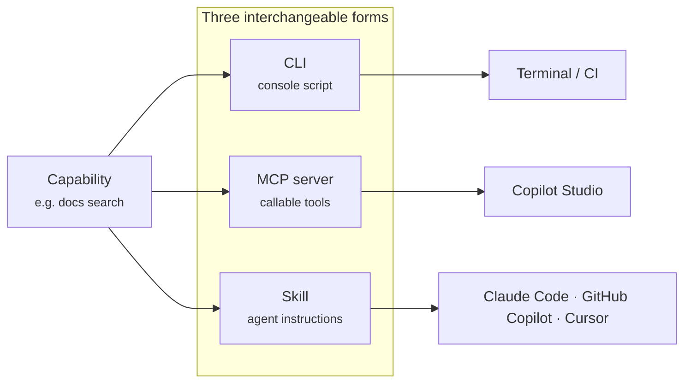
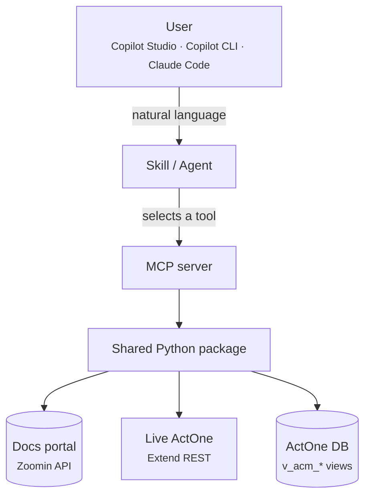

# Ecosystem & architecture

<figure class="actwise-figure" markdown>

<figcaption>ActWise at a glance — core engineering capabilities on the left, the AI-ready ecosystem on the right, all sharing one Python distribution and config layer. (Conceptual overview.)</figcaption>
</figure>

ActWise is a **brand for an ecosystem of AI agents, skills, and CLIs around NICE
Actimize products** — surfaced across **Microsoft Copilot Studio**, **GitHub
Copilot**, and **Claude Code**. The common technical fabric is **MCP servers + CLIs
+ skills**: each capability is built **once** as a portable MCP/CLI, then exposed
through whichever surface you happen to be in.

## The "build once, surface everywhere" idea

Every ActWise capability is delivered in three interchangeable forms that share the
same underlying Python package:

| Form | You use it in | Example |
| --- | --- | --- |
| **CLI** (console script) | a terminal, scripts, CI | `docenter search "blotter"` |
| **MCP server** | any MCP-aware AI agent, and Copilot Studio | `docenter-mcp` (docs search as a tool) |
| **Skill** | Claude Code / GitHub Copilot / Cursor / … | `actimize-docenter` (instructions that drive the CLI) |

A **skill** is *instructions only* — it teaches an AI agent when and how to call the
CLI. An **MCP server** wraps the same logic as callable *tools*. The **CLI** is the
executable core. This is why the [project map](index.md#project-map) lists a CLI, an
MCP, and a skill for most buckets.



## Capability buckets

The toolkit is organized into capability **buckets** under `components/`. Each is a
self-contained slice — its own packages, CLI, MCP server(s), and skill(s):

```
components/
├─ core/       shared path/config resolution (used by every bucket)
├─ docenter/   search / extract / publish the NICE Actimize docs portal
├─ ops/        live ActOne REST surface (read + gated writes)
├─ data/       read-only natural-language → SQL over ActOne reporting views
├─ utils/      server-side ActOne Java maintenance utilities
├─ nicedl/     search / download official install media (NICE Download Center)
├─ installer/  install Actimize packages + stand up ActOne locally on Docker
└─ portal/     static web portal fronting the Copilot Studio agent
```

See the [Buckets overview](buckets/index.md).

## How a request flows

The three grounded ActWise Copilot Studio agents ([Docs](agents/docs.md),
[Data](agents/data.md), [Ops](agents/ops.md)) each talk to an **MCP server**, which
in turn calls the same code the CLIs use:



There are **two front-door topologies** for the Copilot Studio experience:

- **[ActWise (Main)](agents/main.md)** — an *orchestrator* that routes each request
  to one of three specialist child agents.
- **[ActWise (Main1)](agents/main1.md)** — a *single agent* with all three MCP
  servers attached directly.

Both are documented, with an A/B comparison, on the
[agents overview](agents/index.md).

## Grounding & safety principles

- **No fabrication.** Docs answers are quoted from official documentation with
  citations; data answers come only from real query results; ops reports real API
  responses including errors.
- **Read-first.** Data is strictly read-only. Ops and the installer/utilities gate
  every state-changing action behind an explicit confirmation or `--yes`/`--execute`.
- **Your credentials, your data.** ActWise ships no NICE content — it uses your own
  authenticated portal / ActOne / DB sessions.

## Platform context

While building ActWise, NICE Actimize's own **CoreAI** platform, a hosted **DOCenter
MCP** server, and an **Actimize Skills marketplace** were found to already provide
much of this fabric internally. ActWise's stance is therefore to **adopt the
official fabric where it exists and extend it where it doesn't** — the ActWise Docs
agent, for example, can be pointed at either the ActWise-hosted docenter MCP or the
official DOCenter MCP.
