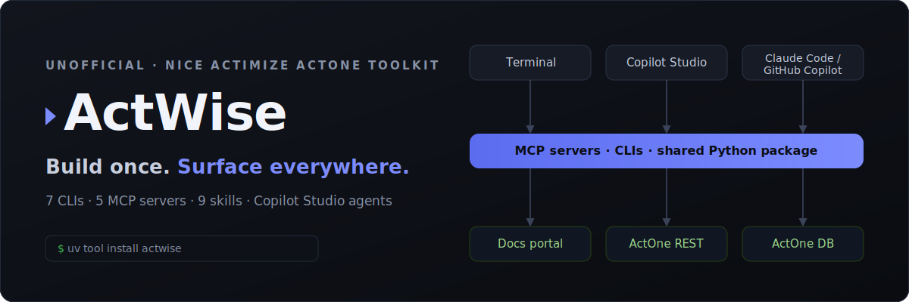

# ActWise

**ActWise is an unofficial NICE Actimize engineering toolkit** — a single Python
distribution that bundles the **CLIs, MCP servers, Copilot skills, and Copilot
Studio agents** an ActOne engineer needs day to day. One install puts every tool on
your PATH, and every component shares one config-resolution layer.

!!! warning "Unofficial — not a NICE Actimize product"
    ActWise is an **experimental, beta** personal project. It is **not** a NICE
    Actimize product and is **not affiliated with, endorsed by, or supported by
    NICE Ltd.** "NICE" and "Actimize" are trademarks of their respective owners and
    are used here only to describe interoperability. Provided **as-is, without
    warranty**. It ships **no** NICE Actimize content — the tools retrieve
    documentation and data on demand using **your own** authenticated sessions.
    See [Legal & disclaimer](legal.md).

## What it gives you

Everything an ActOne engineer touches, made scriptable and AI-drivable:

- 🔎 **Search & extract** the live NICE Actimize documentation portal.
- 🛰️ **Drive a live ActOne** instance's REST surface (read, and gated writes).
- 📊 **Ask questions in plain English** and get real numbers via read-only SQL over
  the ActOne reporting views.
- 🧰 **Run the server-side Java utilities** (blotter maintenance, DART, and more).
- ⬇️ **Download** official install media from the NICE Download Center.
- 🐳 **Stand up ActOne locally** on Docker + PostgreSQL.

Each capability exists **three ways** — as a **CLI**, as an **MCP server**, and as a
**Copilot skill** — so you can use it in a terminal, from an AI agent (Claude Code,
GitHub Copilot, Cursor…), or inside a **Copilot Studio** agent. See
[Ecosystem](ecosystem.md).

## Project map

One bucket per capability under `components/`. Each bucket owns its packages, CLI
console scripts, MCP servers, Copilot skill(s), and (where relevant) a Copilot
Studio agent.

| Bucket | CLI | MCP | Skill | Copilot agent |
| --- | --- | --- | --- | --- |
| [core](buckets/core.md) | — | — | — | — |
| [docenter](buckets/docenter.md) | [`docenter`](cli/docenter.md) | [`docenter-mcp`](mcp/docenter-mcp.md), [`actimize-docs-mcp`](mcp/actimize-docs-mcp.md) | [actimize-docenter](skills/actimize-docenter.md) | [ActWise Docs](agents/docs.md) |
| [ops](buckets/ops.md) | [`actone`](cli/actone.md) | [`actone-mcp`](mcp/actone-mcp.md) | [actone-ops](skills/actone-ops.md), [actone-api-suite](skills/actone-api-suite.md) | [ActWise Ops](agents/ops.md) |
| [data](buckets/data.md) | [`actone-data`](cli/actone-data.md) | [`actone-data-mcp`](mcp/actone-data-mcp.md) | [actone-data](skills/actone-data.md) | [ActWise Data](agents/data.md) |
| [utils](buckets/utils.md) | [`actone-utils`](cli/actone-utils.md) | [`actone-utils-mcp`](mcp/actone-utils-mcp.md) | [actone-utils](skills/actone-utils.md) | — |
| [nicedl](buckets/nicedl.md) | [`ndc`](cli/ndc.md) | — | [actimize-nicedl](skills/actimize-nicedl.md) | — |
| [installer](buckets/installer.md) | [`actimize-installer`](cli/actimize-installer.md), [`actone-local`](cli/actone-local.md) | — | [actimize-installer](skills/actimize-installer.md), [actone-local](skills/actone-local.md) | — |

## Start here

- :material-play-circle: **[Demo overview](demo.md)** — a short narrated
  walkthrough of the live ActWise agent: cited docs, plain-English data, and
  gated live operations.
- :material-download: **[Install & onboarding](install.md)** — get every console
  script on your PATH and complete first-run setup.
- :material-sitemap: **[Ecosystem](ecosystem.md)** — how the CLI + MCP + skill
  fabric spans Copilot Studio, GitHub Copilot, and Claude Code.
- :material-console: **[CLIs](cli/index.md)** — the seven command-line tools.
- :material-robot: **[Copilot Studio agents](agents/index.md)** — the ActWise
  agents and how to reproduce them.

