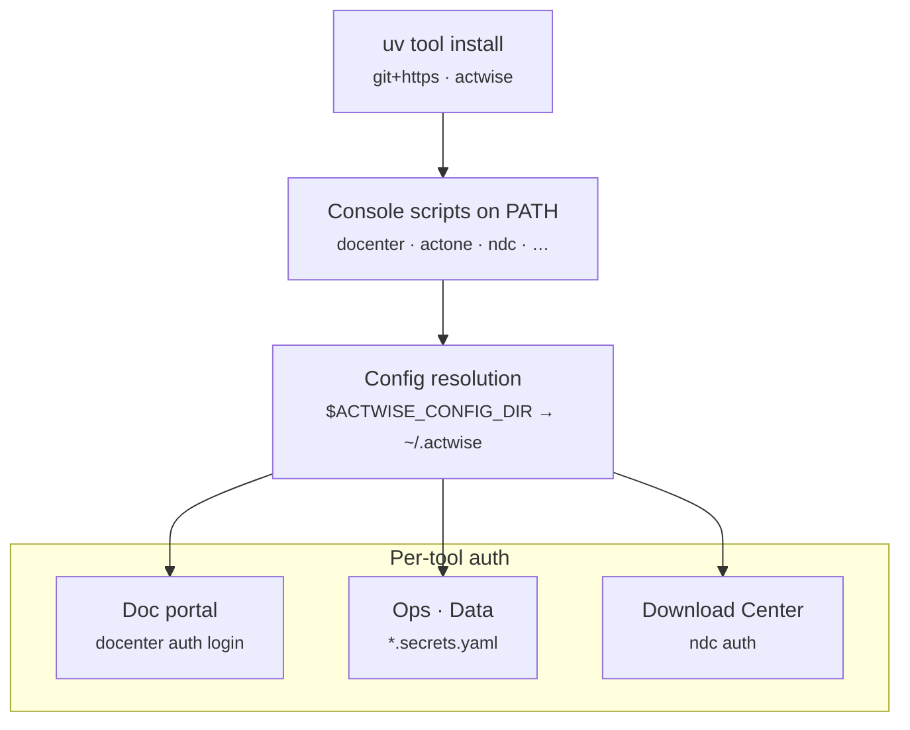

# Install & onboarding

Get from zero to a working ActWise install — CLIs, per-user config, doc-portal auth,
MCP servers, and skills.



!!! warning "Unofficial — beta"
    ActWise ships **no** NICE Actimize content and is not a NICE product. It uses
    **your own** authenticated sessions. See [Legal & disclaimer](legal.md).

## 1. Prerequisites

- **Python 3.10+**
- **[uv](https://docs.astral.sh/uv/)** (`pip install uv` or the standalone installer)
- **git** with access to the ActWise repository

## 2. Install the tool

```powershell
uv tool install "git+https://github.com/vinayguda/actwise.git"
```

This puts every ActWise console script on your PATH:
`docenter` · `docenter-mcp` · `actimize-docs-mcp` · `actone` · `actone-mcp` ·
`actone-utils` · `actone-utils-mcp` · `actone-data` · `actone-data-mcp` · `ndc` ·
`actimize-installer` · `actone-local`.

### Sanity check

```powershell
docenter --help
actone --help
actone-data --help
ndc --help
```

All four should print help without error.

## 3. Per-user config

ActWise resolves config through `$ACTWISE_CONFIG_DIR` → cwd → `~/.actwise` → repo
root (see [Configuration](config.md)). The recommended home for an installed user is
`~/.actwise`.

```powershell
mkdir ~/.actwise

# Ops (live ActOne REST): environment catalog + secrets
copy components\ops\actone-ops.example.yaml         $HOME\.actwise\actone-ops.yaml
copy components\ops\actone-ops.secrets.example.yaml $HOME\.actwise\actone-ops.secrets.yaml

# Data (read-only SQL): DB profile catalog + secrets
copy components\data\actone-data.example.yaml         $HOME\.actwise\actone-data.yaml
copy components\data\actone-data.secrets.example.yaml $HOME\.actwise\actone-data.secrets.yaml
```

Then edit the copied files:

- **`actone-ops.yaml`** — a profile per ActOne instance (URL, `context_root`, user,
  `allow_writes`). Passwords go in `actone-ops.secrets.yaml`, never in the profile.
- **`actone-data.yaml`** — a DB profile per environment (host, port, name, read-only
  user, schema). Passwords go in `actone-data.secrets.yaml`.

### Env-var alternatives

- `ACTONE_URL`, `ACTONE_USER`, `ACTONE_PASSWORD`, `ACTONE_CONTEXT_ROOT` — the ops
  `default` environment.
- `ACTONE_DB_HOST`, `ACTONE_DB_PORT`, `ACTONE_DB_NAME`, `ACTONE_DB_USER`,
  `ACTONE_DB_PASSWORD` — the data default profile.
- `ACTWISE_CONFIG_DIR` — point every component at one config directory.

## 4. Doc-portal auth

The documentation commands need a NICE Actimize portal session:

```powershell
docenter auth login      # opens a browser for SSO; cookie saved locally
docenter auth status     # confirm the session
```

## 5. MCP registration

Register the ActWise MCP servers with your AI client. A Claude Code / Copilot CLI
project `.mcp.json` (drop into the workspace root):

```json
{
  "mcpServers": {
    "actimize-docs": { "command": "actimize-docs-mcp" },
    "actone-ops":    { "command": "actone-mcp" },
    "actone-utils":  { "command": "actone-utils-mcp" },
    "actone-data":   { "command": "actone-data-mcp" }
  }
}
```

See the [MCP servers overview](mcp/index.md) for transports and per-server detail.

## 6. Skills

The ActWise Copilot skills follow the open [Agent Skills](https://agentskills.io)
spec, so they install into **any** supported agent (Claude Code, Cursor, Codex,
GitHub Copilot, Gemini, Windsurf …) via the [`skills`](https://www.skills.sh) CLI:

```powershell
# Interactive — prompts for scope (project vs global) and which agents:
npx skills add https://github.com/vinayguda/actwise.git

# All skills, globally, for every detected agent:
npx skills add https://github.com/vinayguda/actwise.git --all -g

# Or a single skill:
npx skills add https://github.com/vinayguda/actwise.git --skill actimize-docenter -a claude-code -g
```

Skills are **instructions only** — they drive the console scripts from step 2, so
keep the CLI on your PATH. See the [Skills overview](skills/index.md).

## 7. Developer setup (optional)

```powershell
git clone https://github.com/vinayguda/actwise.git
cd actwise
pip install -e ".[dev]"
pytest -q
```

After editing code, refresh the installed tool:

```powershell
uv tool install . --force
```
