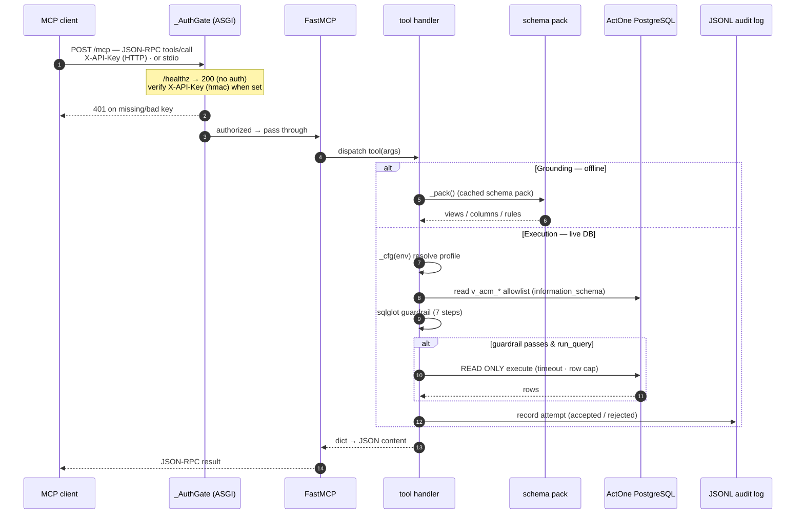
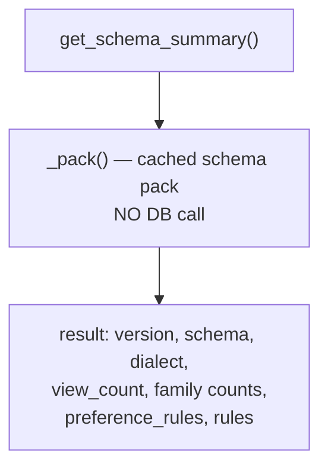
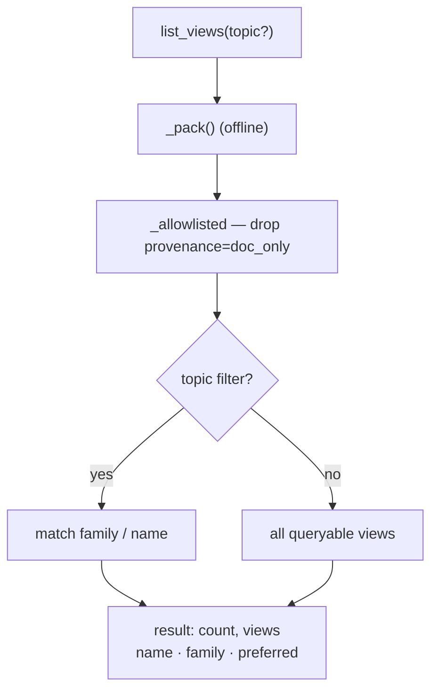
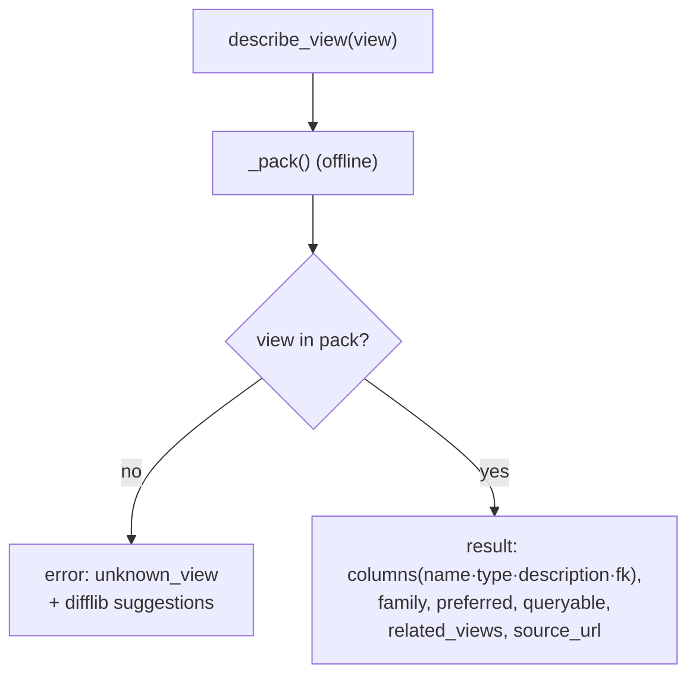
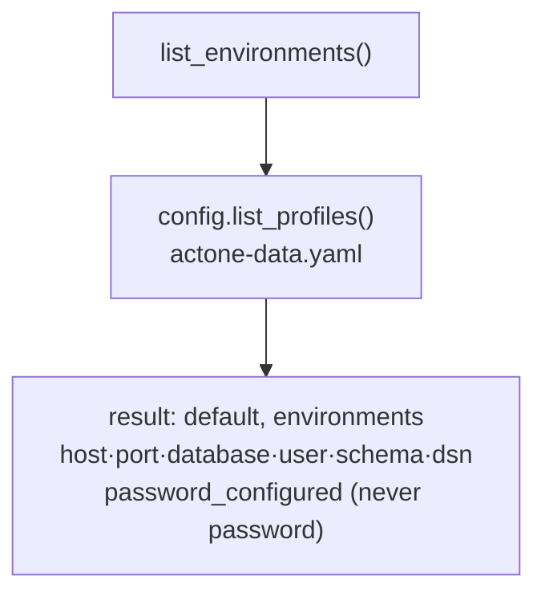
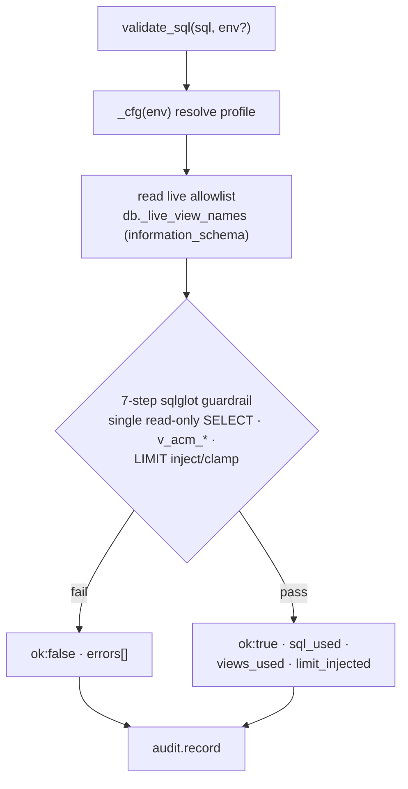
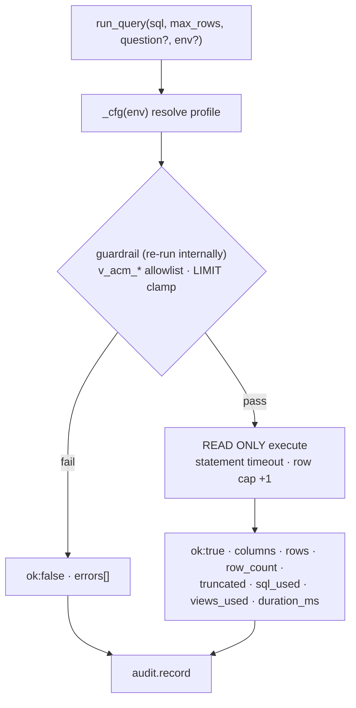
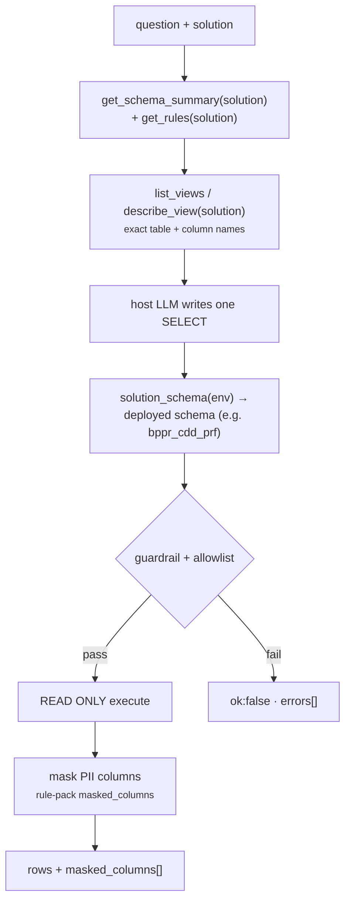
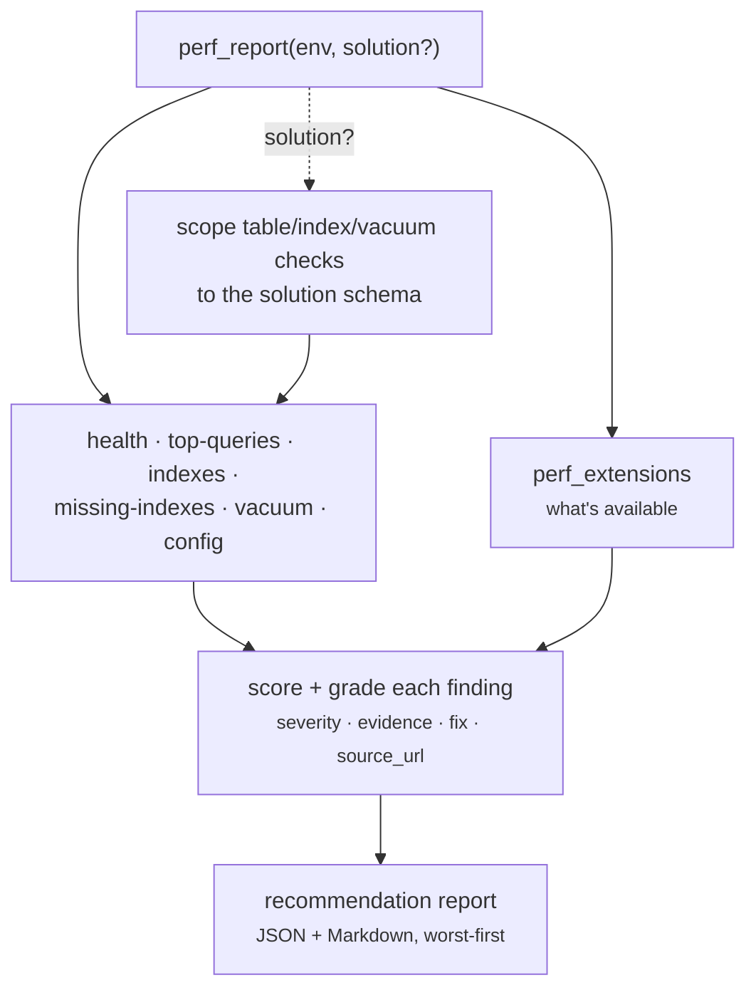

# actone-data-mcp

> Read-only natural-language-to-SQL over the ActOne platform **and its installed
> solutions** (SAM, CDD, STAR, QAS, …), plus a read-only **performance-tuning**
> diagnostics suite — grounds, validates, and executes; never writes.

## Goal

Answer data questions about ActOne (alerts, work items, cases, blotters, queues,
users, item types, policies) **and the solutions layered on top of it** with real
rows. The host LLM writes a single SQL `SELECT`; this engine grounds it on exact
view/column names from the relevant **solution schema pack**, applies that
solution's **rule pack** (query conventions + PII masking), proves it through a
`sqlglot` guardrail (single read-only SELECT, injected/clamped LIMIT), and
executes it in a `READ ONLY`, row-capped, audited transaction. A second,
parallel **performance diagnostics** surface (Surface B) runs fixed,
server-authored catalog queries — the model *names a tool*, it never writes
catalog SQL. The engine holds **no LLM key and no write path**.

## Two tool surfaces

The server exposes **20 read-only tools** across two surfaces:

1. **Surface A — NL-to-SQL grounding + execution** (solution-aware): discover a
   solution's schema/rules, then validate and run a single guardrailed `SELECT`.
2. **Surface B — performance diagnostics**: fixed `pg_catalog` / `pg_stat_*` /
   `pg_settings` checks the model *invokes by name*, rolled up into a scored,
   doc-cited recommendation report.

## How it fits

- **Bucket:** [data](../buckets/data.md).
- **Shares code with:** the [`actone-data`](../cli/actone-data.md) CLI — the MCP
  tools call the same schema pack, guardrail pipeline, and DB layer as
  `actone-data schema` / `query validate` / `query run`.
- **Consumed by:** the **ActWise Data** Copilot Studio agent
  ([agent page](../agents/data.md)), grounded on this server via a
  self-hosted, API-key-gated MCP endpoint. Local IDE agents can register it over
  stdio.

## Tools exposed

Enumerated from `components/data/actone_data_mcp/server.py` — **20 `@mcp.tool`
registrations, all read-only**, in three groups.

**Grounding (offline — served from the bundled schema/rule packs, no DB):**

| Tool | What it does |
|------|--------------|
| `list_solutions` | Discover every grounded surface — the ActOne platform plus each solution pack — with `surface`, `schema`, `version`, object counts, description coverage, and `draft` status. Call first to pick a `solution`. |
| `list_business_solutions` | A product's licensed **business solutions** (IFM Remote/Commercial/Private Banking, Card, Deposit, Authentication-IQ, New Account Fraud) + optional add-ons, each with official name, aliases, license flag, detection processes, and `v_ff_*`/table markers. A business solution is a license-driven subset of ONE install (not a separate installer, except New Account Fraud). |
| `get_schema_summary` | Overview of the query surface — DB version, schema, view/table counts by family, preference + global rules. Accepts `solution` to summarize a solution pack. Call once, first. |
| `get_rules` | The solution's **rule pack** (doc-mined from the Actimize Implementer/Installation guides): query conventions, preferred/deprecated views, masked (PII) columns, and any solution-specific constraints the model must honor. A base ActOne pack of universal best practices is inherited by every solution. |
| `list_views` | List queryable `v_acm_*` views (or a `solution` pack's tables); legacy alert views marked `preferred: false`. Filter by `topic`. |
| `describe_view` | One view/table's columns (`name`/`type`/`description`/`fk`), `related_views`, `source_url`, and preferred item equivalents. Accepts `solution`. |

**Execution (live DB — guardrailed, read-only):**

| Tool | What it does |
|------|--------------|
| `validate_sql` | Dry-run the guardrail on a SQL string (no execution): `{ok, errors, sql_used, views_used, limit_injected}`. Scoped by `env` + `solution`. |
| `run_query` | Validate **and** execute a read-only SELECT: columns, rows, row_count, truncated, sql_used, duration, and `masked_columns` (redacted PII). Scoped by `env` + `solution`. |
| `detect_business_solutions` | Which **business solutions** a live deployment actually runs — introspects the resolved IDB/app schemas, matches catalog markers, and returns `present`/`absent`/`config_only` so grounding can be scoped to the fraud lines a client is licensed for. Scoped by `env` + `solution`. |
| `list_environments` | List the **database (DATA)** environment profiles for read-only SQL — metadata only, never passwords. |

**Performance & diagnostics — Surface B (fixed server-authored catalog queries):**

| Tool | What it does |
|------|--------------|
| `perf_extensions` | Which perf extensions are installed (`pg_stat_statements`, `pgstattuple`, `hypopg`). |
| `perf_health_check` | Cache hit ratio, rollbacks/deadlocks, connection saturation, transaction-ID wraparound headroom. |
| `perf_top_queries` | Worst queries from `pg_stat_statements` (`sort`: total\|mean\|io\|calls). |
| `perf_index_issues` | Unused and invalid indexes (drop / REINDEX candidates). |
| `perf_missing_indexes` | Tables with heavy sequential scans (indexing hotspots). |
| `perf_vacuum_health` | Dead-tuple accumulation + autovacuum recency/settings. |
| `perf_bloat_estimate` | Table bloat via `pgstattuple` (degrades gracefully if absent). |
| `perf_config_review` | Key planner / memory / autovacuum settings (advisory). |
| `perf_report` | Scored recommendation report rolling up all checks — including advisory `CREATE INDEX` candidates for unindexed foreign keys; each finding carries severity, evidence, fix, and a `source_url` doc citation. Accepts `solution` to scope table/index/vacuum checks to that solution's schema. |
| `explain_query` | `EXPLAIN (FORMAT JSON)` a guardrail-validated SELECT, optionally `analyze` or with **hypothetical** HypoPG indexes. Scoped by `env` + `solution`. |

> Extension-backed perf checks **degrade gracefully** — they return
> `{"available": false, "note": …}` rather than erroring when the extension is
> absent, mirroring how version detection degrades on a stampless DB.

## Request flow — tool call to the engine

Every tool call travels the **same lifecycle**: an MCP client `POST`s JSON-RPC to
`/mcp` (Copilot Studio) or attaches over stdio (local IDE agents), the `_AuthGate`
ASGI middleware authenticates HTTP callers, FastMCP dispatches the `@mcp.tool`
handler, and the handler runs against one of two backends. **Grounding**
(`get_schema_summary` / `list_views` / `describe_view`) answers **offline** from
the bundled schema pack (`_pack()`, cached) — no DB. **Execution**
(`validate_sql` / `run_query`) resolves the target profile (`_cfg(env)`), reads
the **live** `v_acm_*` allowlist from `information_schema`, proves the SQL through
the shared `sqlglot` guardrail, and only then opens a `READ ONLY` connection.
`list_environments` reads config profiles (metadata only, never passwords). Every
execution attempt — accepted or rejected — is appended to the JSONL audit log.

Code path: `actone_data_mcp/server.py` (tools + transport) →
`actone_data.{schema_pack, guardrails, db, config, audit}` — the same engine the
[`actone-data`](../cli/actone-data.md) CLI drives.

### Shared request lifecycle



### `get_schema_summary`

Offline overview of the query surface — call it **once, first**. Reads the cached
schema pack and returns the DB version, schema, view counts by family, the
item-preference rules, and the global query rules, so the model orients before
naming any view.



### `list_views`

Lists the **queryable** `v_acm_*` views (doc-only views hidden), optionally
filtered by `topic`. Legacy `v_acm_alert*` views are returned but flagged
`preferred: false` so the model steers to the item equivalents.



### `describe_view`

Full detail for one view: columns (`name` / `type` / `description` / `fk`),
`related_views`, `source_url`, and preference. An unknown name returns
`difflib` close-match `suggestions` instead of an error — served entirely offline.



### `list_environments`

Lists the **database (DATA)** connection profiles for read-only SQL — metadata
only. Reads `actone-data.yaml` via `config.list_profiles()`; passwords are never
returned.



### `validate_sql`

Dry-runs the guardrail on a SQL string — **no execution**. Resolves the target
profile, reads that environment's **live** `v_acm_*` allowlist, then runs the
7-step `sqlglot` pipeline and returns the normalized SQL that *would* run. The
attempt is audited.



### `run_query`

Validates **and** executes a read-only SELECT. The guardrail **re-runs inside**
`db.run_query`, so skipping `validate_sql` cannot bypass it; execution runs in a
`READ ONLY` transaction with a statement timeout and a row cap (fetches
`max_rows + 1` to flag truncation). Every attempt is audited with the originating
question.



> Full parameter/return contracts for each tool live in the tool docstrings in
> `components/data/actone_data_mcp/server.py`; the safety model is summarized under
> [Safety](#safety) below.

## Multi-solution grounding

ActOne is a **stack**, not a single product. The base platform ships the
`v_acm_*` reporting views; each installed **solution** either *enhances* the base
schema (e.g. **QAS** adds tables to the ActOne/RCM schema with no schema of its
own) or *adds its own schema* alongside it (e.g. **STAR**, **CDD Profiles**,
**SAM**). Live deployments prefix the logical schema with a customer/environment
token (e.g. logical `cdd_prf` → deployed `bppr_cdd_prf`).

The engine models each solution as a **schema pack** (tables + columns +
descriptions + FK graph, package-DDL-derived and doc-enriched) paired with a
**rule pack** (query conventions + PII masking). The grounding tools take a
`solution` argument and serve that pack, so the model discovers a solution's
surface before querying it. `run_query`/`validate_sql`/`explain_query` resolve
the deployed schema name automatically via the environment's schema prefix.

| Solution | Own schema | Grounding pack | Notes |
|---|---|---|---|
| ActOne (base) | `actone` / `rcm` (`v_acm_*` views) | ✅ | Permission-aware item views. |
| QAS | *none — enhances base* | ✅ | Adds tables into the RCM schema. |
| SAM | `sam_app` | ✅ | Suspicious Activity Monitoring. |
| CDD | `cdd_app` | ✅ | Customer Due Diligence. |
| CDD Profiles | `cdd_prf` | ✅ | KYC profile store; direct-identifier columns masked. |
| CDD DART | `cdd_drt` | ✅ | Detection Analytics & Reporting Tool. |
| STAR | `star_app` | ✅ | Suspicious Transaction Activity Reporting. |
| IFM | `ifm_app` | ✅ | Integrated Fraud Management application schema (live-validated on `fhba`). |
| IFM IDB (data) | `ff_idb_data` | ✅ | Investigation Database — where ingested transactions & analytics results land (DART/reporting). 155 tables + 206 `v_ff_*`/`v_acm_*` views (view columns live-typed on `fhba`). Separate DB. |
| IFM IDB (staging) | `ff_idb_stg` | ✅ | IDB staging buffer — a transient ETL load buffer, **not** a reporting surface (rules steer to IFM IDB data). |
| WLF | `wlf_lm` | draft | Package-DDL-derived; pending live validation. |
| CTR | `ctr_app` | draft | Currency Transaction Reporting — placeholder pack (encrypted package); filings surface as ActOne work items. |

**PII masking.** A rule pack may declare `constraints.masked_columns`; matching
output columns are redacted to `***REDACTED***` at result time (name-based,
case-insensitive) and reported back in `run_query`'s `masked_columns` field. The
CDD Profiles (KYC) pack masks direct-identifier columns (names, DOB,
passport/ID numbers, address, phone, email) while leaving codes/flags/keys intact.



## Performance & diagnostics (Surface B)

A second, parallel tool surface identifies performance issues **without letting
the model author catalog SQL** — each `perf_*` tool runs a fixed, server-authored
query over `pg_catalog` / `pg_stat_*` / `pg_settings` on the shared read-only
session, so the read-only + audit guarantees hold. `perf_report` rolls the
individual checks into a scored, graded recommendation report; every finding
carries a severity, evidence, a concrete fix, and a `source_url` linking to the
authoritative PostgreSQL documentation for that dimension.



## Transport & run

Runs as **stdio or HTTP**. Console script from `pyproject.toml`
(`actone-data-mcp = "actone_data_mcp.server:main"`):

```powershell
actone-data-mcp
# or, as an ASGI HTTP app (serves /mcp, health /healthz):
python -m uvicorn actone_data_mcp.server:app --port 8766
```

The HTTP transport is **self-hosted**; when `ACTONE_DATA_PROXY_API_KEY` is set it
enforces an `X-API-Key` header (mandatory for any tunnelled deployment — how the
ActWise Data agent reaches it).

## Self-host setup

1. **Configure a database profile.** Copy
   `components/data/actone-data.example.yaml` to `~/.actwise/actone-data.yaml`
   (resolution order: `$ACTWISE_CONFIG_DIR` → cwd → `~/.actwise` → repo root) and
   set each profile's `host`, `port`, `dbname`, `schema` (the client's `bppr_rcm`
   / `acm` schema), and `user`. Profile YAML holds **no passwords**.
2. **Provide the password** out-of-band: `ACTONE_DB_PASSWORD__<PROFILE>` (profile
   name upper-cased, non-alphanumerics → `_`) or an `actone-data.secrets.yaml`
   beside the config.
3. **Grant a read-only DB login.** The engine only ever issues a single `READ ONLY`
   `SELECT` over `v_acm_*` views; a login with `SELECT` on those views is enough
   (and safest).
4. **Point at the schema pack** if your deployment differs — the bundled
   `v_acm_*` metadata grounds query generation; no fetch step is required.
5. **Shared HTTP deploy:** set `ACTONE_DATA_PROXY_API_KEY` and require the
   `X-API-Key` header on the tunnel. VPN-gated databases are only reachable when
   the host is on the corporate VPN.

## Safety

Strictly **read-only**. The guardrail always re-runs inside `run_query`, so it
cannot be bypassed by skipping `validate_sql`: only a single `SELECT`/`UNION`
over allowlisted `v_acm_*` views is permitted, execution runs in a `READ ONLY`
transaction with a statement timeout and row cap, and every attempt is appended
to a JSONL audit log. It steers to permission-aware `v_acm_item*` views over
legacy `v_acm_alert*`.

## See also

- CLI: [`actone-data`](../cli/actone-data.md)
- Bucket: [data](../buckets/data.md)
- Agent: [ActWise Data](../agents/data.md)
