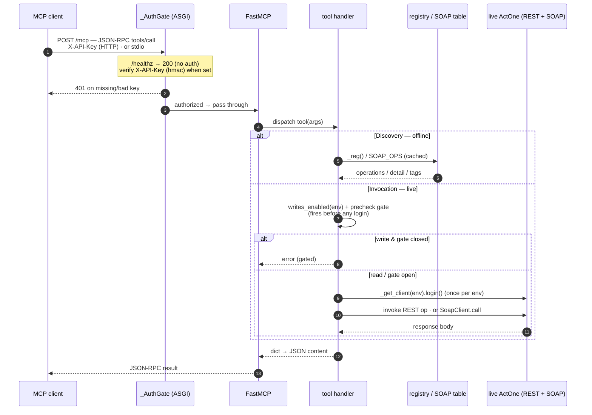
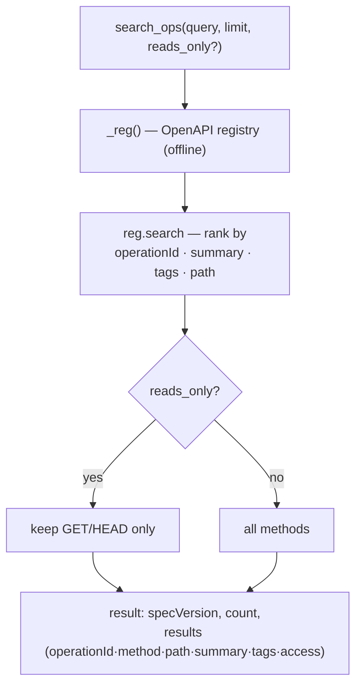
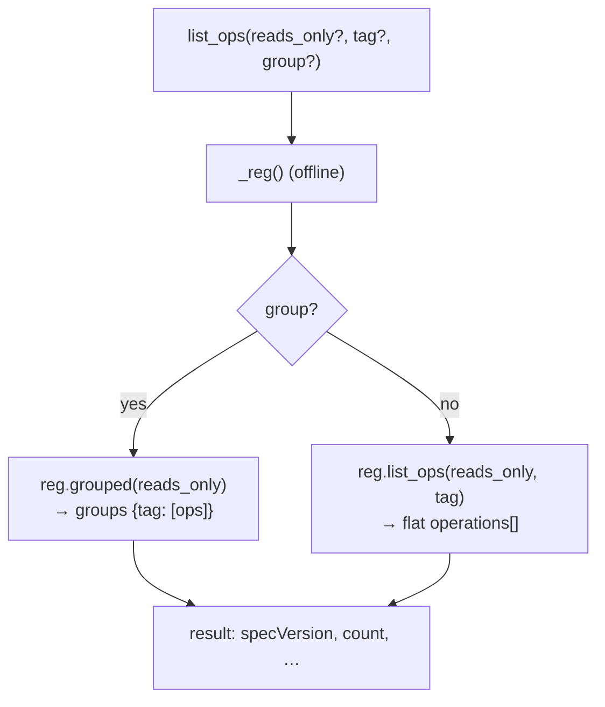
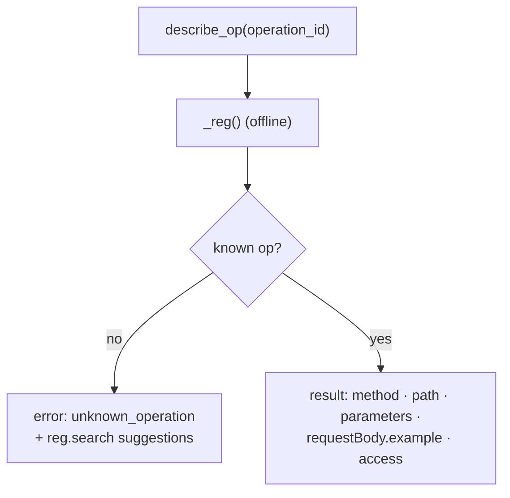
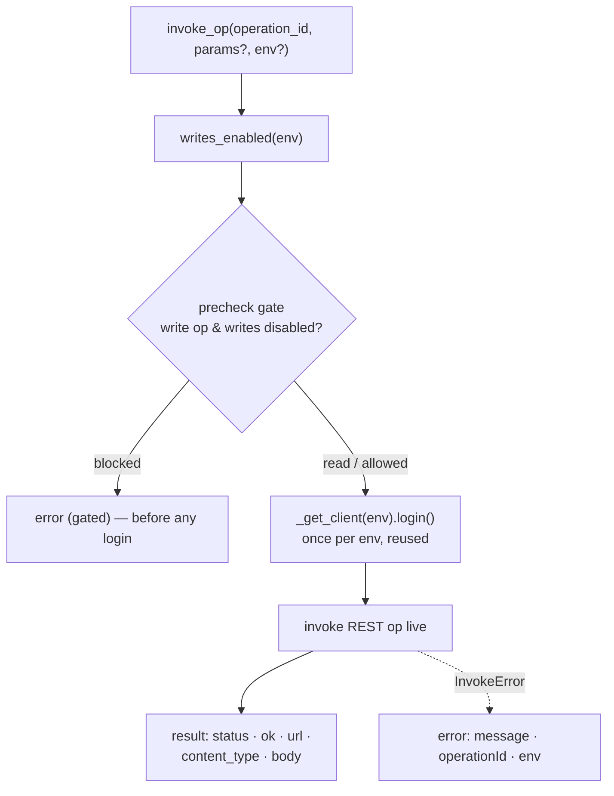
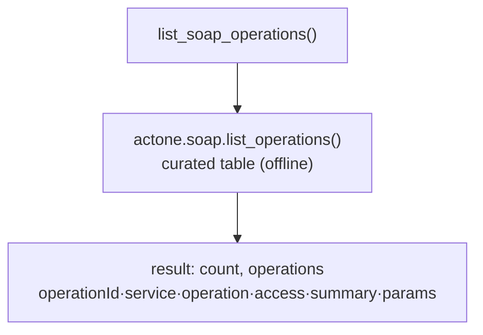
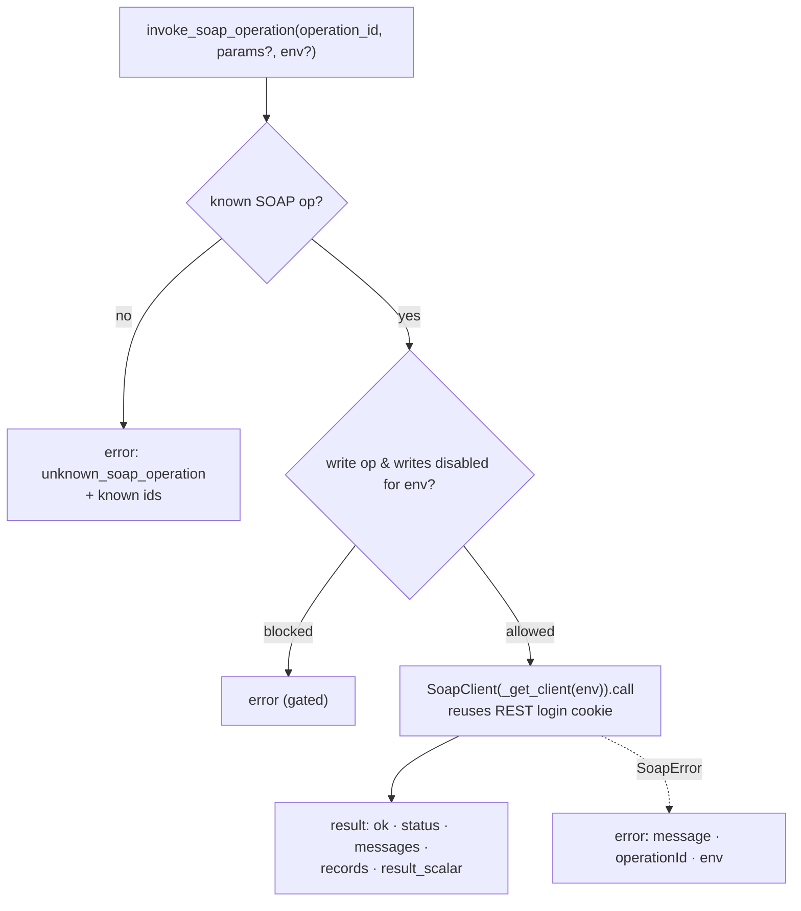
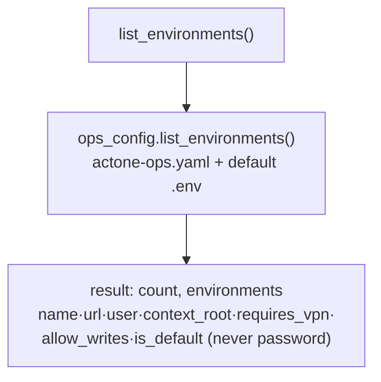
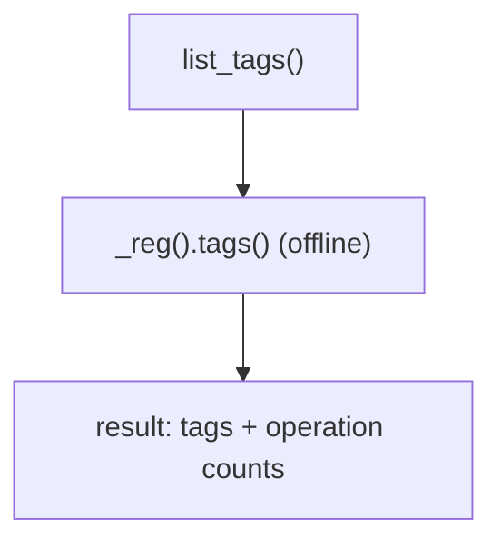

# actone-mcp

> Turns a live ActOne instance into a discoverable REST (and curated SOAP)
> surface — a `search → describe → invoke` loop with writes gated by default.

## Goal

Let an agent operate a running ActOne instance safely: discover operations by
keyword over the Extend REST API OpenAPI spec, inspect their parameters and
read/write access, then invoke them live. Read (GET) operations run freely; any
write is refused unless the operator opted in server-side. It also exposes a
curated set of legacy **SOAP** admin operations (e.g. create Business Unit) the
REST API lacks.

## How it fits

- **Bucket:** [ops](../buckets/ops.md).
- **Shares code with:** the [`actone`](../cli/actone.md) CLI's `actone ops`
  runtime discovery loop and its SOAP module — the MCP tools call the same
  registry, client, and gate logic.
- **Consumed by:** the **ActWise Ops** Copilot Studio agent
  ([agent page](../agents/ops.md)), grounded on this server through a
  self-hosted, API-key-gated MCP endpoint. Local IDE agents can register it over
  stdio.

## Tools exposed

Enumerated from `components/ops/actone_mcp/server.py` — eight `@mcp.tool`
registrations (FastMCP):

| Tool | What it does |
|------|--------------|
| `search_ops` | Discover REST operations by keyword (operationId / summary / tags / path); `reads_only` to filter to GETs. |
| `list_ops` | Enumerate the **entire** operation surface (uncapped); filter by `tag` / `reads_only`, or `group` by tag. |
| `describe_op` | Full detail for one operation: method, path, parameters, request-body example, read/write access. |
| `invoke_op` | Invoke a REST operation live. GETs always run; writes refused unless `ACTONE_ALLOW_WRITES` is truthy in the server env. |
| `list_soap_operations` | List the curated ActOne SOAP admin operations (offline), incl. Business-Unit create. |
| `invoke_soap_operation` | Invoke a curated SOAP operation live; write ops require the target environment to permit writes. |
| `list_environments` | List the live **administration** (OPS) environments — name, url, user, `allow_writes`, `requires_vpn`, … (never the password). |
| `list_tags` | List operation tags (functional domains) and their operation counts. |

## Request flow — tool call to a live ActOne instance

Every tool call travels the **same lifecycle**: an MCP client `POST`s JSON-RPC to
`/mcp` (Copilot Studio) or attaches over stdio (local IDE agents), the `_AuthGate`
ASGI middleware authenticates HTTP callers, and FastMCP dispatches the `@mcp.tool`
handler. **Discovery** (`search_ops` / `list_ops` / `describe_op` / `list_tags` /
`list_soap_operations`) answers **offline** from the operation registry (built once
from the live/cached/bundled OpenAPI spec) and the curated SOAP table — no live
call. **Invocation** (`invoke_op` / `invoke_soap_operation`) runs the write gate
**before any login**, logs in once per environment (client reused across calls),
then calls the live ActOne REST (or reuses that login cookie for SOAP).
`list_environments` reads config profiles (metadata only, never passwords).

Code path: `actone_mcp/server.py` (tools + transport) →
`actone.{registry, invoke, soap, ops_config}` — the same registry, client, and
gate logic the [`actone`](../cli/actone.md) CLI's `actone ops` loop drives.

### Shared request lifecycle



### `search_ops`

Discover REST operations by keyword (operationId / summary / tags / path) from the
offline registry — the **start** of the loop. An empty query lists everything
(ranked); `reads_only` restricts to GETs.



### `list_ops`

Enumerate the **entire** operation surface (no cap) — unlike `search_ops`. Filter
by `tag` and/or `reads_only`, or set `group=True` to organize by tag.



### `describe_op`

Full detail for one operation: method, path, parameters, request-body example, and
read/write access — used to assemble `params` for `invoke_op`. An unknown id
returns `suggestions`.



### `invoke_op`

Invoke a REST operation live. The write gate (`writes_enabled` + `precheck`)
**fires before any login**; GETs always run, writes are refused unless
`ACTONE_ALLOW_WRITES` is truthy in the server env. The client logs in once per
environment and is reused.



### `list_soap_operations`

List the curated ActOne **SOAP** admin operations (offline) — the legacy Axis
surface the REST API lacks, most importantly create Business Unit. Each entry
feeds `invoke_soap_operation`.



### `invoke_soap_operation`

Invoke a curated SOAP op live. Reads always run; writes (create/remove) are refused
unless the target environment permits writes (`allow_writes: true`, or
`ACTONE_ALLOW_WRITES` for `default`). Reuses the **same authenticated session** as
the REST ops (the login cookie authorizes SOAP).



### `list_environments`

List the live **administration (OPS)** environments — server instances for
operations and writes (distinct from the Data MCP's DB environments). Reads
`actone-ops.yaml` + the built-in `default` (`.env`); passwords are never returned.



### `list_tags`

List the operation tags (functional domains) and their operation counts from the
offline registry — a quick map of the ActOne surface.



> Full parameter/return contracts for each tool live in the tool docstrings in
> `components/ops/actone_mcp/server.py`; the write-gate model is summarized under
> [Safety](#safety) below.

## Transport & run

Runs as **stdio or HTTP**. Console script from `pyproject.toml`
(`actone-mcp = "actone_mcp.server:main"`):

```powershell
actone-mcp
# or, as an ASGI HTTP app (serves /mcp, health /healthz):
python -m uvicorn actone_mcp.server:app --port 8765
```

The HTTP transport is **self-hosted**; when `ACTONE_PROXY_API_KEY` is set it
enforces an `X-API-Key` header (required for any shared/tunnelled deployment,
which is how the ActWise Ops agent reaches it).

## Self-host setup

1. **Configure an environment.** Copy `components/ops/actone-ops.example.yaml` to
   `~/.actwise/actone-ops.yaml` (resolution order: `$ACTWISE_CONFIG_DIR` → cwd →
   `~/.actwise` → repo root) and set each profile's `url`, `context_root`, `user`,
   and — for shared/QAS instances — `requires_vpn: true` and `allow_writes: false`.
   The shipped example carries a `local-dev` (`http://localhost:8082`, matches the
   `actone-local` container) and a placeholder `popular-qas-dev` — replace the host
   with your own instance. Profile YAML holds **no passwords**.
2. **Provide the password** out-of-band: `ACTONE_PASSWORD__<ENV>` (env name
   upper-cased, non-alphanumerics → `_`, e.g. `ACTONE_PASSWORD__POPULAR_QAS_DEV`)
   or an `actone-ops.secrets.yaml` beside the config.
3. **Fetch the OpenAPI spec once (required).** The published snapshot ships **no
   bundled REST spec**, so `search_ops`/`describe_op`/`invoke_op` need one fetched
   from your live instance first:

   ```powershell
   actone fetch-spec --url http://<host>:8080/RCM --user <user> --password <pwd>
   ```

   This discovers the springdoc/springfox spec, converts Swagger2→OAS3, and caches
   it under `<workdir>/postman/specs/*.oas3.json` where the registry auto-resolves
   it. Override explicitly with `--spec <path>` or `ACTONE_SPEC`. (The SOAP tools
   and `list_environments` work without a spec.)
4. **Gate writes** per environment (`allow_writes: true` in the profile) and/or the
   global `ACTONE_ALLOW_WRITES` — default-deny otherwise.
5. **Shared HTTP deploy:** set `ACTONE_PROXY_API_KEY` and require the `X-API-Key`
   header on the tunnel. VPN-gated instances are only reachable when the host is on
   the corporate VPN.

## Safety

**Default-deny writes.** Read operations always run; write operations
(POST/PUT/DELETE/PATCH, and SOAP create/remove) are gated — the REST gate is the
global `ACTONE_ALLOW_WRITES`, and SOAP/named environments require
`allow_writes: true` in `actone-ops.yaml`. The gate is server-side; the model
cannot lift it itself, and it fires before any login. The agent's contract is to
confirm-before-write.

## See also

- CLI: [`actone`](../cli/actone.md) (`actone ops …`)
- Bucket: [ops](../buckets/ops.md)
- Agent: [ActWise Ops](../agents/ops.md)
