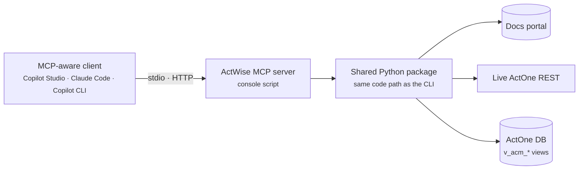

# ActWise MCP servers

> The Model Context Protocol (MCP) servers ActWise ships — each re-exposes a
> bucket's proven CLI code path as tools an AI agent can call.

ActWise is a NICE Actimize engineering toolkit packaged as one Python
distribution. Five of its capability [buckets](../buckets/index.md) ship an MCP
server as a console script, so the same grounded, gated logic that powers the
CLIs is also callable by agents (VS Code, Claude Code, the GitHub Copilot CLI)
and by the Copilot Studio agents under `agents/`.

> **Unofficial project.** ActWise is an unofficial, experimental personal side
> project. It is **not** a NICE Actimize product and is not affiliated with,
> endorsed by, or supported by NICE Ltd. It ships no NICE Actimize content — each
> server retrieves data on demand using your own authenticated session.

## Servers

| Server | Transport | Bucket | Purpose |
|--------|-----------|--------|---------|
| [`docenter-mcp`](docenter-mcp.md) | HTTP (Streamable) | [docenter](../buckets/docenter.md) | Live, version-precise NICE Actimize portal search + page fetch, with citation URLs. |
| [`actimize-docs-mcp`](actimize-docs-mcp.md) | stdio | [docenter](../buckets/docenter.md) | Offline BM25 search over the extracted `raw_docs/` Markdown corpus. |
| [`actone-mcp`](actone-mcp.md) | stdio or HTTP | [ops](../buckets/ops.md) | Discover, describe, and invoke live ActOne REST/SOAP operations (writes gated). |
| [`actone-data-mcp`](actone-data-mcp.md) | stdio or HTTP | [data](../buckets/data.md) | Read-only NL→SQL over the ActOne `v_acm_*` reporting views. |
| [`actone-utils-mcp`](actone-utils-mcp.md) | stdio or HTTP | [utils](../buckets/utils.md) | Discover, describe, and (gated) run ActOne server-side Java utilities. |

## Shared conventions

- **Console scripts.** Each server is installed as a console script by the
  `actwise` distribution — no module paths needed. Names come straight from
  `pyproject.toml` `[project.scripts]`.
- **Self-hosted.** The HTTP servers are meant to be self-hosted. The Copilot
  Studio agents reach them through a self-hosted, API-key-gated MCP endpoint;
  local IDE agents run them over stdio or against a local bind.
- **Config resolution.** Every server resolves config through
  `actwise.paths.find_config()` (see the [core bucket](../buckets/core.md)):
  `$ACTWISE_CONFIG_DIR` → cwd → `~/.actwise` → dev repo root.
- **Safety.** The doc and data servers are strictly read-only; the ops and utils
  servers are default-deny — writes/state changes require an explicit,
  server-side environment gate the model cannot lift itself.

## See also

- [Buckets hub](../buckets/index.md) — the full project map.
- Bucket pages: [docenter](../buckets/docenter.md) · [ops](../buckets/ops.md) ·
  [data](../buckets/data.md) · [utils](../buckets/utils.md)
