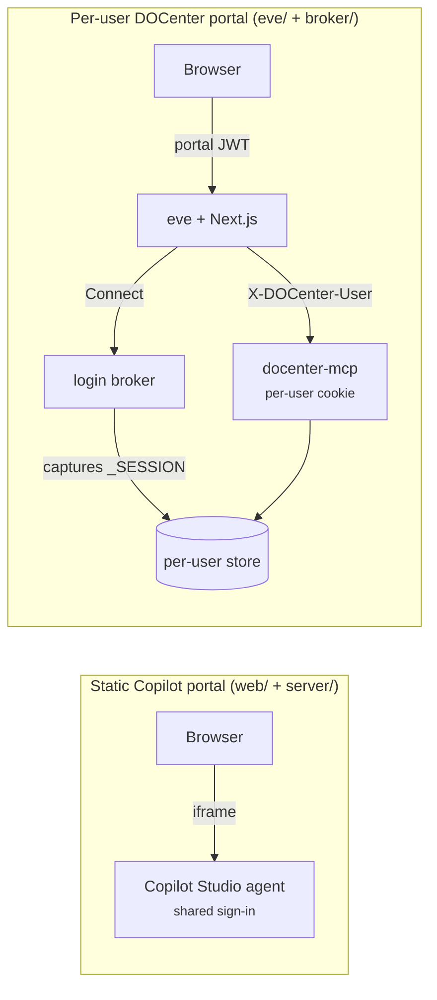

# ActWise portal

> Web front ends for the ActWise agents — a shared Copilot Studio portal, and a
> **per-user DOCenter portal** where every end user queries the live docs with
> their *own* credentials.

## Goal

Give people a browser to talk to ActWise. Two portals, two auth models:

- **Static Copilot portal** — a NiCE-branded static site that embeds the ActWise
  Copilot Studio agent. Everyone shares one agent; Microsoft sign-in happens inside
  the embedded chat canvas. Published behind a Cloudflare tunnel.
- **Per-user DOCenter portal** — a Vercel **eve** + Next.js app where each user
  brings *their own* DOCenter login and gets answers served from *their own*
  captured portal cookie. Built for a public / self-serve audience where a single
  shared cookie won't do.

## How it fits

The per-user path is **additive** and gated behind `DOCENTER_PER_USER`: with it
off, [`docenter-mcp`](mcp/docenter-mcp.md) behaves byte-for-byte as the shared
Copilot path. Nothing about the shared-cookie flow changes.

## Per-user identity, end to end

1. **Sign in.** The eve portal sets a lightweight `portal_user` identity cookie
   (an email). No password is checked *at the portal* — the real credential check
   is the broker door.
2. **Portal JWT.** The browser fetches a short-lived HS256 JWT (`sub` = the user's
   DOCenter id) and sends it to eve's HTTP channel as `Authorization: Bearer …`.
3. **X-DOCenter-User.** eve's docenter connection mints an HMAC-signed
   `X-DOCenter-User` token binding the request to that user and sends it to the
   MCP on every call (a byte-for-byte mirror of the Phase-3 Python verifier).
4. **Per-user cookie.** `docenter-mcp` (with `DOCENTER_PER_USER` on) verifies the
   token, maps the user to *their own* captured DOCenter `_SESSION` cookie, and
   answers with citations. No cookie yet → `SessionRequired`.
5. **Connect.** The portal's "Connect" button asks the **login broker** for a
   one-time `login_url` (the browser never holds the broker secret) and opens it.

## The login broker (two doors)

DOCenter has two account types; each has its own door, and both write the **same**
per-user store, so the MCP serves them identically:

- **Door 1 — SSO** (NICE employees, federated to Entra): the broker drives a
  **hosted interactive browser** to the real DOCenter SSO page and captures the
  user's `_SESSION` cookie. Subject to Entra **Conditional Access**, so the hosted
  browser must be **Edge / Chrome-with-SSO-extension on a managed device** (see the
  R5 go/no-go). Vanilla Chromium is blocked by CA (error 53000).
- **Door 2 — password** (customer/partner accounts on Zoomin, not federated):
  authenticates against the Zoomin login API — **no browser, no Entra, no
  Conditional Access** — so it works from any host.

The single login link opens a **two-door page**, so the chat only ever surfaces
one URL. The broker owns state signing, TTL, and one-time use; passwords are
entered only on that page, never in the chat.

## Under the hood

- **Why a broker at all?** Per-user Entra/OBO auth directly to the docs backend is
  **not viable** — there is no Entra app registration for the portal (proven in the
  auth probe). A hosted browser the user logs into is the only per-user path.
- **Progress UI.** In `next dev`, a turn whose single MCP tool call left the stream
  silent for ~20 s+ used to stall in the browser (the dev rewrite-proxy goes
  open-but-silent and eve's hook only reopens on a real disconnect). The fix bumps
  `maxReconnectAttempts`, renders live tool-activity ("🔍 Searching the
  documentation N×"), and shows a "Working… Ns" indicator. On Vercel `/eve/v1/**`
  is routed natively, so the dev-only stall does not apply.
- **Secrets never reach the browser.** The Next.js route handlers hold the broker
  secret and the HMAC/JWT secrets server-side; the browser carries only the
  short-lived portal JWT `sub`.

## Reference

**Static Copilot portal** — `components/portal/web/` (site) + `components/portal/server/`
(FastAPI Direct Line token broker). Run: `python -m http.server 8080 --directory
components/portal/web`.

**Per-user DOCenter portal** — `components/portal/eve/` (Next.js, Node ≥ 24) +
`components/portal/broker/` (`docenter-broker` console script). Run: `pnpm dev`
(port 3333) alongside `docenter-mcp` (per-user mode) and `docenter-broker`.

Key shared secrets: eve ↔ MCP share `DOCENTER_USER_TOKEN_SECRET`; eve ↔ broker
share `DOCENTER_BROKER_SECRET`.

## See also

- [docenter bucket](buckets/docenter.md) · [`docenter-mcp`](mcp/docenter-mcp.md)
- Repo READMEs: `components/portal/README.md`, `components/portal/eve/README.md`,
  `components/portal/broker/README.md`
